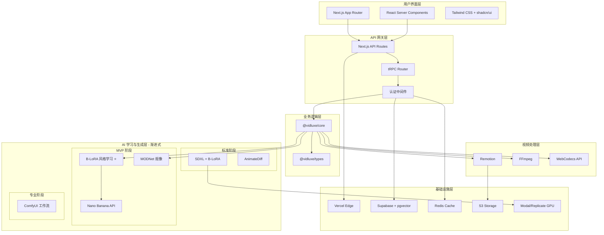
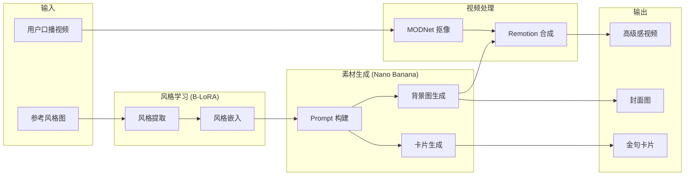
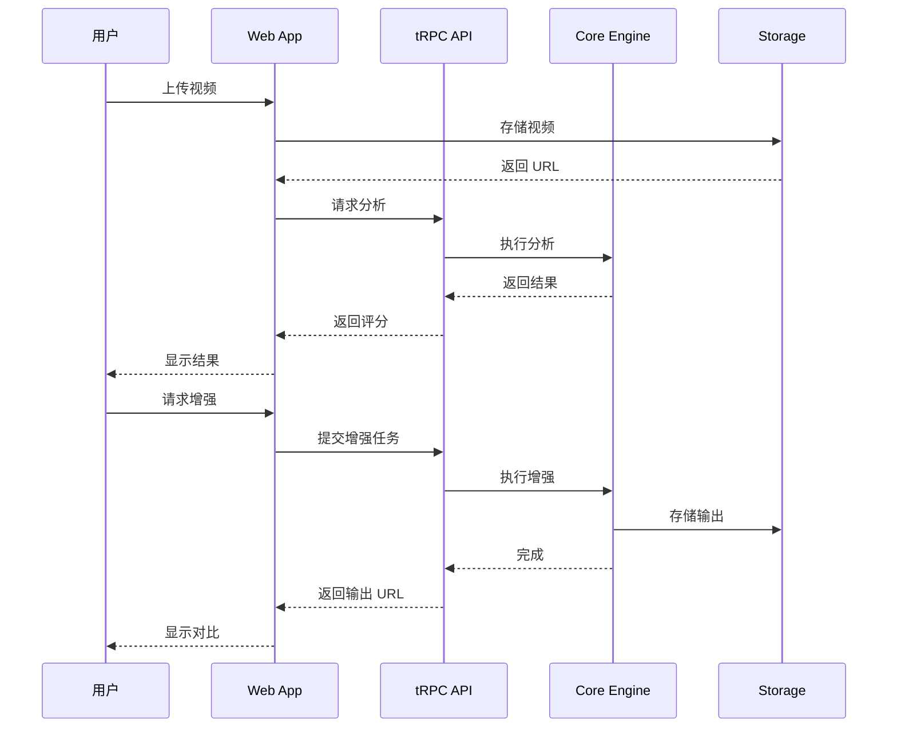

# VidLuxe 系统架构设计

## 架构概览

VidLuxe 采用**渐进式混合架构**，结合现代 Serverless 技术与 AI 服务，实现高可用、可扩展的视频高级感生成系统。

> **架构决策**：采用渐进式混合方案，MVP 阶段以 API 为主，逐步过渡到自建能力。



## 渐进式架构设计

### 架构演进路线

```
┌─────────────────────────────────────────────────────────────┐
│                    渐进式架构演进                             │
├─────────────────────────────────────────────────────────────┤
│                                                             │
│  MVP 阶段（0-3 个月）                                        │
│  ─────────────────                                          │
│  ├─ 风格学习：B-LoRA（本地/Modal 托管）                      │
│  ├─ 素材生成：Nano Banana API                               │
│  ├─ 人物抠像：MODNet API                                    │
│  ├─ 视频合成：Remotion Lambda                               │
│  └─ 特点：Serverless 优先，零运维                           │
│                                                             │
│  标准阶段（3-6 个月）                                        │
│  ─────────────────                                          │
│  ├─ 风格学习：B-LoRA（保持）                                │
│  ├─ 素材生成：SDXL + B-LoRA（高频）/ Nano Banana（低频）     │
│  ├─ 视频风格：+ AnimateDiff                                 │
│  ├─ 部署：Modal/Replicate GPU                               │
│  └─ 特点：成本优化，效果提升                                 │
│                                                             │
│  专业阶段（6-12 个月）                                       │
│  ─────────────────                                          │
│  ├─ 全流程：ComfyUI 工作流                                  │
│  ├─ 风格模型：自训练微调版                                   │
│  ├─ 部署：自有 GPU 或长期合约云 GPU                          │
│  └─ 特点：完全可控，技术壁垒                                 │
│                                                             │
└─────────────────────────────────────────────────────────────┘
```

## 分层设计

### 1. 用户界面层 (Presentation Layer)

**技术选型：**
- **Next.js 14 App Router** - 服务端渲染 + 静态生成
- **React Server Components** - 减少客户端 JS
- **Tailwind CSS + shadcn/ui** - 高度可定制的设计系统

**职责：**
- 页面渲染与路由
- 用户交互处理
- 状态管理 (Zustand / Jotai)
- 数据获取 (TanStack Query)

**关键目录结构：**

```typescript
// apps/web/app/
app/
├── (marketing)/          // 营销页面 (SSG)
│   ├── page.tsx         // 首页
│   ├── pricing/         // 定价页
│   └── about/           // 关于页
│
├── (app)/               // 应用页面 (需登录)
│   ├── dashboard/       // 仪表盘
│   ├── projects/        // 项目列表
│   ├── upload/          // 上传页
│   ├── analyze/[id]/    // 分析页
│   ├── enhance/[id]/    // 增强页
│   └── compare/[id]/    // 对比页
│
├── api/                 // API Routes
│   ├── trpc/           // tRPC 处理
│   ├── auth/           // 认证
│   └── webhook/        // Webhooks
│
└── layout.tsx
```

### 2. API 网关层 (API Gateway)

**技术选型：**
- **Next.js API Routes** - 边缘函数
- **tRPC** - 类型安全的 RPC 调用
- **NextAuth.js** - 身份认证

**职责：**
- 请求路由与负载均衡
- 认证与授权
- 请求限流与缓存
- 日志与监控

**tRPC Router 结构：**

```typescript
// packages/api/src/router/index.ts
import { router } from '@trpc/server';
import { analyzeRouter } from './analyze';
import { enhanceRouter } from './enhance';
import { profileRouter } from './profile';
import { userRouter } from './user';

export const appRouter = router({
  analyze: analyzeRouter,
  enhance: enhanceRouter,
  profile: profileRouter,
  user: userRouter,
});

export type AppRouter = typeof appRouter;
```

### 3. 业务逻辑层 (Business Logic)

**技术选型：**
- **@vidluxe/core** - 核心分析引擎
- **@vidluxe/types** - 类型定义

**核心模块：**

| 模块 | 职责 | 状态 |
|------|------|------|
| ColorAnalyzer | 色彩分析 | ✅ 已实现 |
| PremiumScorer | 评分计算 | ✅ 已实现 |
| ColorRules | 规则库 | ✅ 已实现 |
| TypographyAnalyzer | 排版分析 | 🚧 待实现 |
| CompositionAnalyzer | 构图分析 | 🚧 待实现 |
| MotionAnalyzer | 动效分析 | 🚧 待实现 |
| AudioAnalyzer | 音频分析 | 🚧 待实现 |
| DetailAnalyzer | 细节分析 | 🚧 待实现 |

### 4. AI 学习与生成层 (AI Learning & Generation Layer)

> **渐进式混合方案**：采用分阶段架构，MVP 以 API 为主，逐步过渡到自建能力。

#### 4.1 架构决策

```
为什么选择渐进式方案？

❌ 纯 API 方案：长期成本不可控，缺乏技术壁垒
❌ 纯自建方案：初期技术风险高，运维复杂
✅ 渐进式方案：平衡风险与收益，快速验证商业价值

核心理念：
"先用成熟 API 快速验证，再逐步自建技术壁垒"
```

#### 4.2 MVP 阶段技术选型

| 组件 | 技术 | 用途 | 来源 |
|------|------|------|------|
| **风格学习** | **B-LoRA** | 单图风格学习 ⭐ | [GitHub](https://github.com/yardenfren1996/B-LoRA) |
| **素材生成** | Nano Banana API | 高级感图片生成 | 商业 API |
| **人物抠像** | MODNet API | 视频抠像 | 开源 + API |
| **视频合成** | Remotion | 程序化视频 | 开源 |
| **Prompt 模板** | 自建 | 高级感 Prompt | 参考 Remotion 官方模板 |

#### 4.3 标准阶段技术选型（3-6 月后）

| 组件 | 技术 | 变化 | 理由 |
|------|------|------|------|
| 风格学习 | B-LoRA | 保持 | 效果好 |
| **素材生成** | **SDXL + B-LoRA** | 替换 Nano Banana | 成本降低 70% |
| **视频风格** | **+ AnimateDiff** | 新增 | 时序一致性更好 |
| 人物抠像 | MODNet | 自部署 | 降低 API 成本 |

#### 4.4 专业阶段技术选型（6-12 月后）

| 组件 | 技术 | 变化 | 理由 |
|------|------|------|------|
| **全流程** | **ComfyUI 工作流** | 统一编排 | 灵活可控 |
| **风格模型** | **自训练微调版** | 差异化 | 建立壁垒 |
| 部署 | 自有 GPU | 降低边际成本 | 规模效应 |

#### 4.5 核心模块（MVP 阶段）

| 模块 | 职责 | 状态 | 包 |
|------|------|------|-----|
| **BLoRALoader** | **B-LoRA 模型加载** | 🚧 待实现 | @vidluxe/learning |
| **StyleExtractor** | **单图风格提取** | 🚧 待实现 | @vidluxe/learning |
| **NanoBananaClient** | **Nano Banana API 封装** | 🚧 待实现 | @vidluxe/generator |
| **PromptBuilder** | **高级感 Prompt 构建** | 🚧 待实现 | @vidluxe/generator |
| **Segmenter** | **MODNet 人物抠像** | 🚧 待实现 | @vidluxe/generator |
| **VideoComposer** | **Remotion 视频合成** | 🚧 待实现 | @vidluxe/generator |

#### 4.6 生成流程（MVP 阶段）

```typescript
// packages/generator/src/index.ts

/**
 * MVP 阶段生成管道
 * 风格学习: B-LoRA
 * 素材生成: Nano Banana API
 * 视频合成: Remotion
 */
interface MVPGenerationPipeline {
  // Phase 1: 风格学习 (B-LoRA)
  extractStyle(referenceImage: ImageData): Promise<StyleEmbedding>;

  // Phase 2: Prompt 构建
  buildPrompt(style: StyleEmbedding, content: ContentAnalysis): GenerationPrompt;

  // Phase 3: 素材生成 (Nano Banana)
  generateAssets(prompt: GenerationPrompt): Promise<GeneratedAssets>;

  // Phase 4: 视频合成 (Remotion)
  composeVideo(assets: GeneratedAssets, personVideo: Video): Promise<VideoOutput>;
}

interface GeneratedAssets {
  backgrounds: ImageAsset[];    // 高级感背景图（B-LoRA 风格）
  textCards: ImageAsset[];      // 金句卡片
  coverImage: ImageAsset;       // 封面图
}
```

#### 4.7 数据流架构（MVP 阶段）



#### 4.7 高级感 Prompt 库

```typescript
// packages/generator/src/prompts/index.ts

export const PREMIUM_PROMPTS = {
  minimal: {
    background: `
      Create a premium minimalist background.
      - Deep charcoal (#1A1A1A) to soft gray gradient
      - Subtle geometric pattern, low opacity
      - Soft blue accent (#4A90A4)
      - Apple keynote aesthetic
      - 60% negative space minimum
    `,
    textCard: `
      Design a premium text card.
      - Clean sans-serif font
      - Generous letter spacing (0.08em)
      - White text on dark background
      - Subtle glass morphism
      - Maximum 3 lines
    `
  },

  warmLuxury: {
    background: `
      Create a luxurious warm-toned background.
      - Warm beige to deep brown
      - Subtle marble texture
      - Gold accent touches (#C9A962)
      - Chanel campaign aesthetic
    `,
    textCard: `
      Design an elegant luxury card.
      - Serif font for titles
      - Gold accent on key words
      - Cream background
      - Maximum 2 lines
    `
  },

  morandi: {
    background: `
      Create a Morandi-style background.
      - Muted sage green, dusty pink, warm gray
      - Soft, diffused lighting
      - Kinfolk magazine aesthetic
    `,
    textCard: `
      Design a Morandi-style card.
      - Light serif font
      - Earthy accent colors
      - Generous white space
    `
  }
};
```

### 5. 视频处理层 (Video Processing)

**技术选型：**
- **Remotion** - React-based 视频渲染
- **FFmpeg** - 底层视频处理
- **WebCodecs API** - 浏览器端处理

**处理流程：**

```typescript
interface VideoProcessingPipeline {
  // 1. 视频解析
  extractFrames(video: VideoSource): Promise<Frame[]>;

  // 2. 帧分析
  analyzeFrames(frames: Frame[]): Promise<AnalysisResult>;

  // 3. 帧增强
  enhanceFrames(frames: Frame[], profile: PremiumProfile): Promise<Frame[]>;

  // 4. 视频合成
  composeVideo(frames: Frame[], audio?: AudioTrack): Promise<VideoOutput>;
}
```

### 6. 基础设施层 (Infrastructure)

**技术选型：**

| 组件 | 技术 | 用途 |
|------|------|------|
| 部署平台 | Vercel | 边缘计算 + Serverless |
| 数据库 | Supabase (PostgreSQL) | 用户数据 + 项目数据 |
| 缓存 | Redis (Upstash) | API 缓存 + 会话 |
| 存储 | S3 (Cloudflare R2) | 视频文件 + 资源 |
| 队列 | Inngest / Trigger.dev | 异步任务处理 |

## 技术选型理由

### 框架选择：Next.js 14

| 特性 | 优势 |
|------|------|
| App Router | 文件系统路由 + RSC 支持 |
| API Routes | 无需单独 API 服务 |
| Edge Runtime | 全球低延迟 |
| Image Optimization | 自动图片优化 |
| Vercel 集成 | 一键部署 |

### 视频处理：Remotion

| 特性 | 优势 |
|------|------|
| React-based | 前端友好 |
| 程序化生成 | 参数化视频 |
| 服务端渲染 | 无需浏览器 |
| 高质量输出 | 支持各种编码 |

### Monorepo：pnpm + Turborepo

| 特性 | 优势 |
|------|------|
| pnpm | 高效依赖管理 |
| Turborepo | 智能构建缓存 |
| Workspace | 包共享 |

### 类型系统：TypeScript 5.3+

| 特性 | 优势 |
|------|------|
| 类型安全 | 编译时错误检测 |
| IDE 支持 | 智能提示 |
| 生态兼容 | 主流框架支持 |

## 数据流架构



## 安全架构

### 认证流程

```typescript
// NextAuth.js 配置
export const authOptions: NextAuthOptions = {
  providers: [
    GoogleProvider({
      clientId: process.env.GOOGLE_CLIENT_ID!,
      clientSecret: process.env.GOOGLE_CLIENT_SECRET!,
    }),
    EmailProvider({
      server: process.env.EMAIL_SERVER!,
      from: process.env.EMAIL_FROM!,
    }),
  ],
  callbacks: {
    async session({ session, user }) {
      session.user.id = user.id;
      return session;
    },
  },
};
```

### API 安全

```typescript
// Rate Limiting
const rateLimiter = new RateLimiter({
  windowMs: 60 * 1000, // 1 分钟
  max: 100, // 100 次请求
});

// CORS 配置
const corsOptions = {
  origin: ['https://vidluxe.com'],
  methods: ['GET', 'POST'],
  credentials: true,
};
```

## 可扩展性设计

### 水平扩展

- **Serverless 架构**：无状态设计，自动扩展
- **边缘计算**：全球 CDN 节点
- **数据库读写分离**：Supabase 自动处理

### 模块化设计

```typescript
// 分析器接口统一
interface Analyzer<T> {
  analyze(input: AnalyzeInput): Promise<T>;
  getScore(result: T): number;
  getIssues(result: T): Issue[];
  getSuggestions(result: T): Suggestion[];
}

// 新增分析器只需实现接口
class TypographyAnalyzer implements Analyzer<TypographyAnalysis> {
  // 实现接口方法
}
```

## 监控与日志

```typescript
// OpenTelemetry 集成
import { trace } from '@opentelemetry/api';

const tracer = trace.getTracer('vidluxe-core');

export async function analyzeVideo(input: VideoInput) {
  const span = tracer.startSpan('analyzeVideo');
  try {
    const result = await doAnalysis(input);
    span.end();
    return result;
  } catch (error) {
    span.recordException(error);
    span.end();
    throw error;
  }
}
```

## 包结构

```typescript
// Monorepo 结构
packages/
├── types/               # 类型定义 (@vidluxe/types)
├── core/                # 核心分析引擎 (@vidluxe/core)
│   ├── ColorAnalyzer    # 色彩分析 ✅
│   ├── PremiumScorer    # 评分引擎 ✅
│   └── ColorRules       # 规则库 ✅
├── learning/            # AI 学习引擎 (@vidluxe/learning)
│   ├── FeatureExtractor # CLIP 特征提取
│   ├── AestheticScorer  # NIMA 美学评分
│   ├── VectorStore      # 风格向量存储
│   └── StyleMatcher     # 风格匹配
├── generator/           # AI 素材生成引擎 (@vidluxe/generator) 🆕
│   ├── AssetGenerator   # Nano Banana 生成
│   ├── PromptBuilder    # Prompt 构建
│   ├── Segmenter        # 人物抠像
│   └── VideoComposer    # Remotion 合成
├── api/                 # tRPC API (@vidluxe/api)
└── ui/                  # UI 组件 (@vidluxe/ui)
```

## 下一步

- [API 设计规范](./API.md)
- [数据模型设计](./DATA_MODELS.md)
- [模块设计 - 分析引擎](./MODULES/analyzer.md)
- [AI 学习引擎](./MODULES/learning.md)
- [AI 素材生成引擎](./MODULES/generator.md) 🆕
