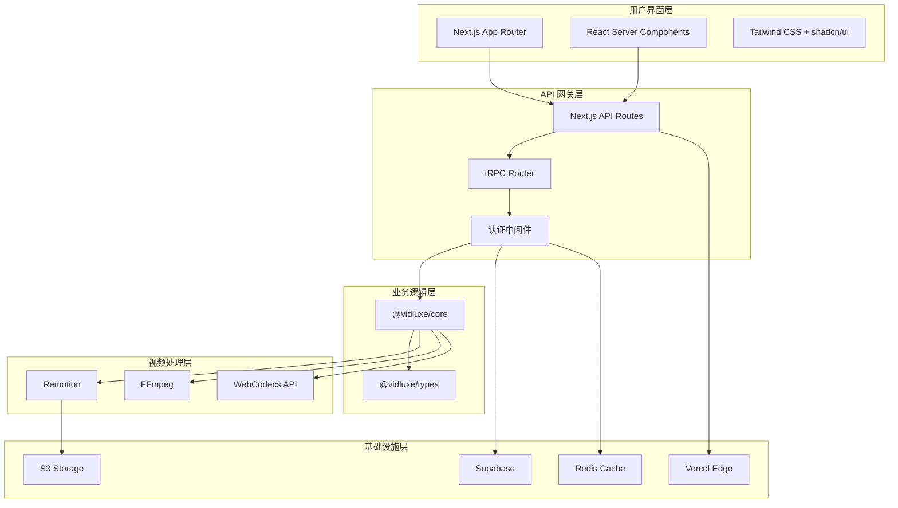
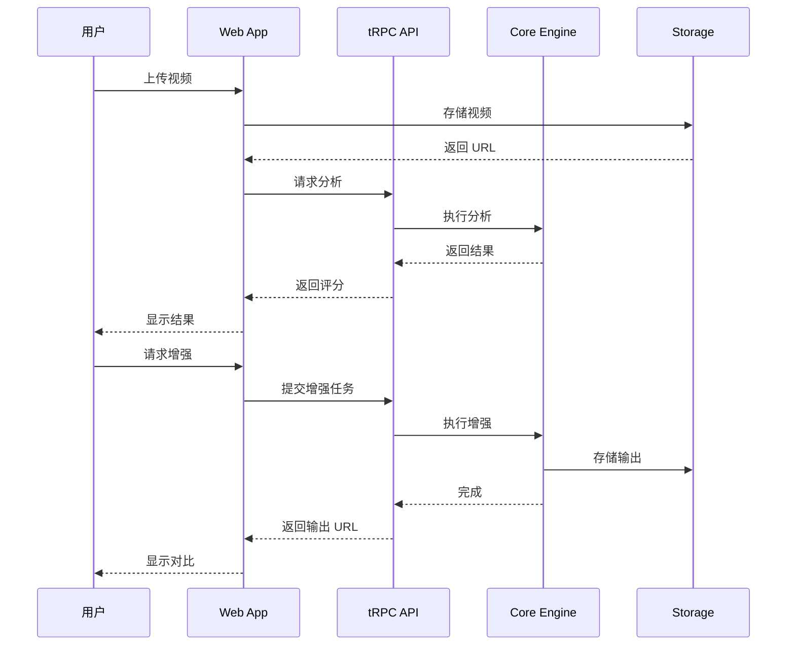

# VidLuxe 系统架构设计

## 架构概览

VidLuxe 采用分层架构设计，结合现代 Serverless 技术，实现高可用、可扩展的视频分析增强系统。



## 分层设计

### 1. 用户界面层 (Presentation Layer)

**技术选型：**
- **Next.js 14 App Router** - 服务端渲染 + 静态生成
- **React Server Components** - 减少客户端 JS
- **Tailwind CSS + shadcn/ui** - 高度可定制的设计系统

**职责：**
- 页面渲染与路由
- 用户交互处理
- 状态管理 (Zustand / Jotai)
- 数据获取 (TanStack Query)

**关键目录结构：**

```typescript
// apps/web/app/
app/
├── (marketing)/          // 营销页面 (SSG)
│   ├── page.tsx         // 首页
│   ├── pricing/         // 定价页
│   └── about/           // 关于页
│
├── (app)/               // 应用页面 (需登录)
│   ├── dashboard/       // 仪表盘
│   ├── projects/        // 项目列表
│   ├── upload/          // 上传页
│   ├── analyze/[id]/    // 分析页
│   ├── enhance/[id]/    // 增强页
│   └── compare/[id]/    // 对比页
│
├── api/                 // API Routes
│   ├── trpc/           // tRPC 处理
│   ├── auth/           // 认证
│   └── webhook/        // Webhooks
│
└── layout.tsx
```

### 2. API 网关层 (API Gateway)

**技术选型：**
- **Next.js API Routes** - 边缘函数
- **tRPC** - 类型安全的 RPC 调用
- **NextAuth.js** - 身份认证

**职责：**
- 请求路由与负载均衡
- 认证与授权
- 请求限流与缓存
- 日志与监控

**tRPC Router 结构：**

```typescript
// packages/api/src/router/index.ts
import { router } from '@trpc/server';
import { analyzeRouter } from './analyze';
import { enhanceRouter } from './enhance';
import { profileRouter } from './profile';
import { userRouter } from './user';

export const appRouter = router({
  analyze: analyzeRouter,
  enhance: enhanceRouter,
  profile: profileRouter,
  user: userRouter,
});

export type AppRouter = typeof appRouter;
```

### 3. 业务逻辑层 (Business Logic)

**技术选型：**
- **@vidluxe/core** - 核心分析引擎
- **@vidluxe/types** - 类型定义

**核心模块：**

| 模块 | 职责 | 状态 |
|------|------|------|
| ColorAnalyzer | 色彩分析 | ✅ 已实现 |
| PremiumScorer | 评分计算 | ✅ 已实现 |
| ColorRules | 规则库 | ✅ 已实现 |
| TypographyAnalyzer | 排版分析 | 🚧 待实现 |
| CompositionAnalyzer | 构图分析 | 🚧 待实现 |
| MotionAnalyzer | 动效分析 | 🚧 待实现 |
| AudioAnalyzer | 音频分析 | 🚧 待实现 |
| DetailAnalyzer | 细节分析 | 🚧 待实现 |

### 4. 视频处理层 (Video Processing)

**技术选型：**
- **Remotion** - React-based 视频渲染
- **FFmpeg** - 底层视频处理
- **WebCodecs API** - 浏览器端处理

**处理流程：**

```typescript
interface VideoProcessingPipeline {
  // 1. 视频解析
  extractFrames(video: VideoSource): Promise<Frame[]>;

  // 2. 帧分析
  analyzeFrames(frames: Frame[]): Promise<AnalysisResult>;

  // 3. 帧增强
  enhanceFrames(frames: Frame[], profile: PremiumProfile): Promise<Frame[]>;

  // 4. 视频合成
  composeVideo(frames: Frame[], audio?: AudioTrack): Promise<VideoOutput>;
}
```

### 5. 基础设施层 (Infrastructure)

**技术选型：**

| 组件 | 技术 | 用途 |
|------|------|------|
| 部署平台 | Vercel | 边缘计算 + Serverless |
| 数据库 | Supabase (PostgreSQL) | 用户数据 + 项目数据 |
| 缓存 | Redis (Upstash) | API 缓存 + 会话 |
| 存储 | S3 (Cloudflare R2) | 视频文件 + 资源 |
| 队列 | Inngest / Trigger.dev | 异步任务处理 |

## 技术选型理由

### 框架选择：Next.js 14

| 特性 | 优势 |
|------|------|
| App Router | 文件系统路由 + RSC 支持 |
| API Routes | 无需单独 API 服务 |
| Edge Runtime | 全球低延迟 |
| Image Optimization | 自动图片优化 |
| Vercel 集成 | 一键部署 |

### 视频处理：Remotion

| 特性 | 优势 |
|------|------|
| React-based | 前端友好 |
| 程序化生成 | 参数化视频 |
| 服务端渲染 | 无需浏览器 |
| 高质量输出 | 支持各种编码 |

### Monorepo：pnpm + Turborepo

| 特性 | 优势 |
|------|------|
| pnpm | 高效依赖管理 |
| Turborepo | 智能构建缓存 |
| Workspace | 包共享 |

### 类型系统：TypeScript 5.3+

| 特性 | 优势 |
|------|------|
| 类型安全 | 编译时错误检测 |
| IDE 支持 | 智能提示 |
| 生态兼容 | 主流框架支持 |

## 数据流架构



## 安全架构

### 认证流程

```typescript
// NextAuth.js 配置
export const authOptions: NextAuthOptions = {
  providers: [
    GoogleProvider({
      clientId: process.env.GOOGLE_CLIENT_ID!,
      clientSecret: process.env.GOOGLE_CLIENT_SECRET!,
    }),
    EmailProvider({
      server: process.env.EMAIL_SERVER!,
      from: process.env.EMAIL_FROM!,
    }),
  ],
  callbacks: {
    async session({ session, user }) {
      session.user.id = user.id;
      return session;
    },
  },
};
```

### API 安全

```typescript
// Rate Limiting
const rateLimiter = new RateLimiter({
  windowMs: 60 * 1000, // 1 分钟
  max: 100, // 100 次请求
});

// CORS 配置
const corsOptions = {
  origin: ['https://vidluxe.com'],
  methods: ['GET', 'POST'],
  credentials: true,
};
```

## 可扩展性设计

### 水平扩展

- **Serverless 架构**：无状态设计，自动扩展
- **边缘计算**：全球 CDN 节点
- **数据库读写分离**：Supabase 自动处理

### 模块化设计

```typescript
// 分析器接口统一
interface Analyzer<T> {
  analyze(input: AnalyzeInput): Promise<T>;
  getScore(result: T): number;
  getIssues(result: T): Issue[];
  getSuggestions(result: T): Suggestion[];
}

// 新增分析器只需实现接口
class TypographyAnalyzer implements Analyzer<TypographyAnalysis> {
  // 实现接口方法
}
```

## 监控与日志

```typescript
// OpenTelemetry 集成
import { trace } from '@opentelemetry/api';

const tracer = trace.getTracer('vidluxe-core');

export async function analyzeVideo(input: VideoInput) {
  const span = tracer.startSpan('analyzeVideo');
  try {
    const result = await doAnalysis(input);
    span.end();
    return result;
  } catch (error) {
    span.recordException(error);
    span.end();
    throw error;
  }
}
```

## 下一步

- [API 设计规范](./API.md)
- [数据模型设计](./DATA_MODELS.md)
- [模块设计](./MODULES/analyzer.md)
