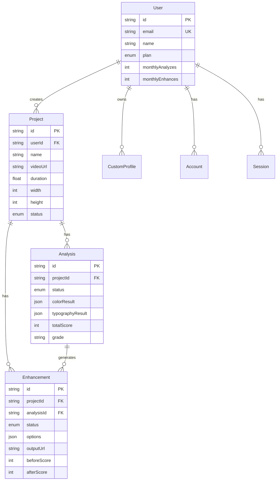

# VidLuxe 数据模型设计

## 概述

本文档定义 VidLuxe 系统的核心数据模型，包括数据库 Schema（Prisma）和 TypeScript 类型定义。

---

## 核心类型定义

### 评分系统

```typescript
// packages/types/src/index.ts

export type PremiumGrade = 'S' | 'A' | 'B' | 'C' | 'D';

export interface DimensionScore {
  score: number;           // 0-100
  weight: number;          // 权重
  issues: string[];        // 问题列表
  suggestions: string[];   // 优化建议
}

export interface PremiumScore {
  // 总分
  total: number;
  grade: PremiumGrade;

  // 各维度得分
  dimensions: {
    color: DimensionScore;       // 色彩协调度 (25%)
    typography: DimensionScore;  // 排版舒适度 (20%)
    composition: DimensionScore; // 构图美感度 (20%)
    motion: DimensionScore;      // 动效流畅度 (15%)
    audio: DimensionScore;       // 音频品质度 (10%)
    detail: DimensionScore;      // 细节精致度 (10%)
  };

  // 对比数据
  comparison?: {
    before: number;
    after: number;
    improvement: number;
    peerAverage: number;
    topCreator: number;
  };

  // 时间戳
  timestamp: string;
}
```

### 色彩分析

```typescript
export interface ColorAnalysis {
  // 基础指标
  saturation: {
    mean: number;
    std: number;
    highRatio: number;
  };

  brightness: {
    mean: number;
    std: number;
  };

  contrast: {
    ratio: number;
    score: number;
  };

  // 高级指标
  dominantColors: RGBColor[];
  colorCount: number;
  colorTemperature: number;  // 色温 (K)
  colorHarmony: number;      // 色彩和谐度 (0-1)
  colorConsistency: number;  // 帧间一致性 (0-1)

  // 评分
  premiumScore: number;
  issues: string[];
  suggestions: string[];
}

export interface RGBColor {
  r: number;
  g: number;
  b: number;
  hex: string;
  name?: string;
}
```

### 风格配置

```typescript
export type PremiumStyle =
  | 'minimal'          // 极简风格
  | 'warm_luxury'      // 暖调奢华
  | 'cool_professional' // 冷调专业
  | 'morandi';         // 莫兰迪

export interface PremiumProfile {
  name: PremiumStyle;
  displayName: string;
  description: string;

  // 色彩参数
  saturation: number;      // 目标饱和度
  contrast: number;        // 目标对比度
  temperature: number;     // 目标色温 (K)
  highlights: number;      // 高光调整
  shadows: number;         // 阴影调整
  colorCountMax: number;   // 最大颜色数

  examples?: string[];
}
```

### 增强选项

```typescript
export interface EnhancementOptions {
  style: PremiumStyle;
  intensity: 'light' | 'medium' | 'strong';
  dimensions: ('color' | 'typography' | 'composition' | 'motion' | 'audio' | 'detail')[];
}

export interface EnhancementResult {
  success: boolean;
  output?: PremiumScore;
  changes: {
    dimension: string;
    before: number;
    after: number;
    description: string;
  }[];
  error?: string;
}
```

---

## 数据库 Schema

### Prisma Schema

```prisma
// prisma/schema.prisma

generator client {
  provider = "prisma-client-js"
}

datasource db {
  provider = "postgresql"
  url      = env("DATABASE_URL")
}

// ============================================================================
// Enums
// ============================================================================

enum Plan {
  FREE
  PRO
  ENTERPRISE
}

enum ProjectStatus {
  UPLOADED
  ANALYZING
  READY
  ENHANCING
  COMPLETED
}

enum AnalysisStatus {
  PENDING
  PROCESSING
  COMPLETED
  FAILED
}

enum EnhancementStatus {
  PENDING
  PROCESSING
  COMPLETED
  FAILED
}

enum PremiumStyle {
  MINIMAL
  WARM_LUXURY
  COOL_PROFESSIONAL
  MORANDI
}

// ============================================================================
// User & Auth
// ============================================================================

model User {
  id            String    @id @default(cuid())
  email         String    @unique
  name          String?
  image         String?
  emailVerified DateTime?

  // Plan & Usage
  plan          Plan      @default(FREE)
  stripeCustomerId String?
  stripeSubscriptionId String?

  // Usage Tracking
  monthlyAnalyzes Int     @default(0)
  monthlyEnhances Int     @default(0)
  usageResetAt    DateTime @default(now())

  // Relations
  accounts      Account[]
  sessions      Session[]
  projects      Project[]
  customProfiles CustomProfile[]

  createdAt     DateTime  @default(now())
  updatedAt     DateTime  @updatedAt

  @@index([email])
}

model Account {
  id                String  @id @default(cuid())
  userId            String
  type              String
  provider          String
  providerAccountId String
  refresh_token     String?
  access_token      String?
  expires_at        Int?
  token_type        String?
  scope             String?
  id_token          String?
  session_state     String?

  user              User    @relation(fields: [userId], references: [id], onDelete: Cascade)

  @@unique([provider, providerAccountId])
  @@index([userId])
}

model Session {
  id           String   @id @default(cuid())
  sessionToken String   @unique
  userId       String
  expires      DateTime
  user         User     @relation(fields: [userId], references: [id], onDelete: Cascade)

  @@index([userId])
}

// ============================================================================
// Projects
// ============================================================================

model Project {
  id            String   @id @default(cuid())
  userId        String
  user          User     @relation(fields: [userId], references: [id], onDelete: Cascade)

  // Video Info
  name          String
  videoUrl      String
  thumbnailUrl  String?
  duration      Float    // seconds
  width         Int
  height        Int
  fps           Float    @default(30)
  fileSize      Int?     // bytes

  // Status
  status        ProjectStatus @default(UPLOADED)

  // Relations
  analyses      Analysis[]
  enhancements  Enhancement[]

  createdAt     DateTime @default(now())
  updatedAt     DateTime @updatedAt

  @@index([userId])
  @@index([status])
}

// ============================================================================
// Analysis
// ============================================================================

model Analysis {
  id            String   @id @default(cuid())
  projectId     String
  project       Project  @relation(fields: [projectId], references: [id], onDelete: Cascade)

  // Status
  status        AnalysisStatus @default(PENDING)
  error         String?

  // Analysis Results (JSON)
  colorResult   Json?    // ColorAnalysis
  typographyResult Json?
  compositionResult Json?
  motionResult  Json?
  audioResult   Json?
  detailResult  Json?

  // Score Summary
  totalScore    Int?
  grade         String?  // PremiumGrade

  // Processing Info
  processedAt   DateTime?
  processingTime Int?    // seconds

  // Relations
  enhancements  Enhancement[]

  createdAt     DateTime @default(now())

  @@index([projectId])
  @@index([status])
}

// ============================================================================
// Enhancement
// ============================================================================

model Enhancement {
  id            String   @id @default(cuid())
  projectId     String
  project       Project  @relation(fields: [projectId], references: [id], onDelete: Cascade)
  analysisId    String?
  analysis      Analysis? @relation(fields: [analysisId], references: [id], onDelete: SetNull)

  // Status
  status        EnhancementStatus @default(PENDING)
  error         String?
  progress      Int      @default(0)

  // Options (JSON)
  options       Json     // EnhancementOptions

  // Results
  outputUrl     String?
  beforeScore   Int?
  afterScore    Int?

  // Processing Info
  processedAt   DateTime?
  processingTime Int?    // seconds

  createdAt     DateTime @default(now())

  @@index([projectId])
  @@index([status])
}

// ============================================================================
// Custom Profiles
// ============================================================================

model CustomProfile {
  id            String   @id @default(cuid())
  userId        String
  user          User     @relation(fields: [userId], references: [id], onDelete: Cascade)

  // Profile Info
  name          String
  displayName   String

  // Parameters
  saturation    Float
  contrast      Float
  temperature   Int
  highlights    Int
  shadows       Int
  colorCountMax Int

  createdAt     DateTime @default(now())
  updatedAt     DateTime @updatedAt

  @@unique([userId, name])
  @@index([userId])
}
```

---

## 数据关系图



---

## 索引策略

### 主键索引

所有表使用 `cuid()` 作为主键，自动创建 B-tree 索引。

### 查询优化索引

```prisma
// 用户邮箱查询
@@index([email])

// 用户项目列表
@@index([userId])
@@index([userId, createdAt])

// 项目状态筛选
@@index([status])

// 分析任务队列
@@index([status, createdAt])

// 增强任务队列
@@index([status, progress])
```

---

## 数据迁移

### 迁移脚本示例

```sql
-- 001_initial_schema.sql

-- 创建扩展
CREATE EXTENSION IF NOT EXISTS "uuid-ossp";

-- 用户表
CREATE TABLE "User" (
  "id" TEXT PRIMARY KEY DEFAULT gen_random_uuid(),
  "email" TEXT NOT NULL UNIQUE,
  "name" TEXT,
  "plan" TEXT NOT NULL DEFAULT 'FREE',
  "monthlyAnalyzes" INTEGER NOT NULL DEFAULT 0,
  "monthlyEnhances" INTEGER NOT NULL DEFAULT 0,
  "createdAt" TIMESTAMP NOT NULL DEFAULT NOW(),
  "updatedAt" TIMESTAMP NOT NULL DEFAULT NOW()
);

-- 项目表
CREATE TABLE "Project" (
  "id" TEXT PRIMARY KEY DEFAULT gen_random_uuid(),
  "userId" TEXT NOT NULL REFERENCES "User"("id") ON DELETE CASCADE,
  "name" TEXT NOT NULL,
  "videoUrl" TEXT NOT NULL,
  "duration" FLOAT NOT NULL,
  "width" INTEGER NOT NULL,
  "height" INTEGER NOT NULL,
  "status" TEXT NOT NULL DEFAULT 'UPLOADED',
  "createdAt" TIMESTAMP NOT NULL DEFAULT NOW(),
  "updatedAt" TIMESTAMP NOT NULL DEFAULT NOW()
);

-- 创建索引
CREATE INDEX "Project_userId_idx" ON "Project"("userId");
```

---

## 使用示例

### 创建项目并分析

```typescript
import { PrismaClient } from '@prisma/client';
import { ColorAnalyzer, PremiumScorer } from '@vidluxe/core';

const prisma = new PrismaClient();

async function createAndAnalyze(userId: string, videoUrl: string) {
  // 1. 创建项目
  const project = await prisma.project.create({
    data: {
      userId,
      name: 'My Video',
      videoUrl,
      status: 'ANALYZING',
      duration: 60,
      width: 1920,
      height: 1080,
    },
  });

  // 2. 创建分析记录
  const analysis = await prisma.analysis.create({
    data: {
      projectId: project.id,
      status: 'PROCESSING',
    },
  });

  // 3. 执行分析
  const analyzer = new ColorAnalyzer();
  const frames = await extractFrames(videoUrl);
  const colorResult = analyzer.analyzeFrames(frames);

  // 4. 计算评分
  const scorer = new PremiumScorer();
  const score = scorer.calculateFromColor(colorResult);

  // 5. 更新分析结果
  await prisma.analysis.update({
    where: { id: analysis.id },
    data: {
      status: 'COMPLETED',
      colorResult: colorResult as any,
      totalScore: score.total,
      grade: score.grade,
      processedAt: new Date(),
    },
  });

  // 6. 更新项目状态
  await prisma.project.update({
    where: { id: project.id },
    data: { status: 'READY' },
  });

  return { project, analysis, score };
}
```

### 查询用户使用量

```typescript
async function getUserUsage(userId: string) {
  const user = await prisma.user.findUnique({
    where: { id: userId },
    select: {
      plan: true,
      monthlyAnalyzes: true,
      monthlyEnhances: true,
      _count: {
        select: {
          projects: true,
        },
      },
    },
  });

  const limits = {
    FREE: { analyzes: 10, enhances: 0 },
    PRO: { analyzes: 100, enhances: 50 },
    ENTERPRISE: { analyzes: Infinity, enhances: Infinity },
  };

  const limit = limits[user!.plan];

  return {
    plan: user!.plan,
    analyzes: {
      used: user!.monthlyAnalyzes,
      limit: limit.analyzes,
      remaining: limit.analyzes - user!.monthlyAnalyzes,
    },
    enhances: {
      used: user!.monthlyEnhances,
      limit: limit.enhances,
      remaining: limit.enhances - user!.monthlyEnhances,
    },
    totalProjects: user!._count.projects,
  };
}
```

---

## 下一步

- [API 设计规范](./API.md)
- [分析模块设计](./MODULES/analyzer.md)
- [测试策略](./TESTING.md)
