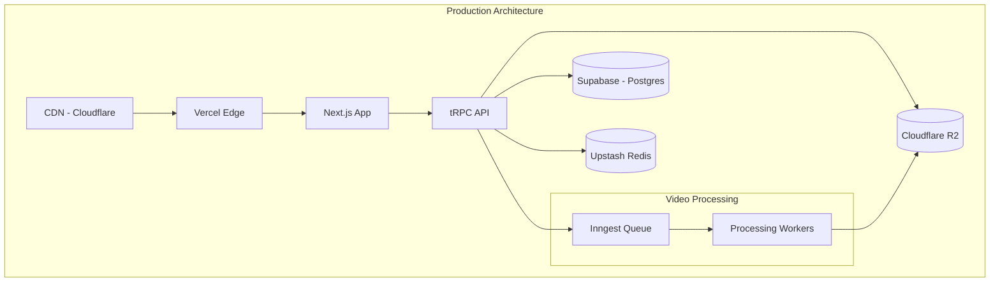

# VidLuxe 部署方案

## 概述

VidLuxe 采用 Serverless 架构，部署在 Vercel 上，数据存储使用 Supabase。这种架构具有高可用性、自动扩展和低运维成本的优势。

---

## 生产架构



---

## 基础设施

### Vercel 配置

```json
// vercel.json
{
  "$schema": "https://openapi.vercel.sh/vercel.json",
  "framework": "nextjs",
  "buildCommand": "pnpm build",
  "devCommand": "pnpm dev",
  "installCommand": "pnpm install",
  "regions": ["sfo1", "iad1"],
  "functions": {
    "app/api/**/*.ts": {
      "memory": 1024,
      "maxDuration": 30
    }
  },
  "headers": [
    {
      "source": "/api/(.*)",
      "headers": [
        { "key": "Access-Control-Allow-Origin", "value": "https://vidluxe.com" },
        { "key": "Access-Control-Allow-Methods", "value": "GET,POST,OPTIONS" },
        { "key": "Access-Control-Allow-Headers", "value": "Content-Type, Authorization" }
      ]
    }
  ],
  "redirects": [
    {
      "source": "/docs",
      "destination": "https://docs.vidluxe.com",
      "permanent": false
    }
  ]
}
```

### 环境变量

```bash
# .env.production

# Database
DATABASE_URL="postgresql://..."
SUPABASE_URL="https://xxx.supabase.co"
SUPABASE_ANON_KEY="eyJ..."
SUPABASE_SERVICE_ROLE_KEY="eyJ..."

# Auth
NEXTAUTH_SECRET="..."
NEXTAUTH_URL="https://vidluxe.com"
GOOGLE_CLIENT_ID="..."
GOOGLE_CLIENT_SECRET="..."

# Storage
R2_ACCOUNT_ID="..."
R2_ACCESS_KEY_ID="..."
R2_SECRET_ACCESS_KEY="..."
R2_BUCKET_NAME="vidluxe-videos"

# Cache
UPSTASH_REDIS_REST_URL="https://..."
UPSTASH_REDIS_REST_TOKEN="..."

# Queue
INNGEST_EVENT_KEY="..."
INNGEST_SIGNING_KEY="..."

# AI Services
GEMINI_API_KEY="..."

# Stripe
STRIPE_SECRET_KEY="sk_live_..."
STRIPE_WEBHOOK_SECRET="whsec_..."
NEXT_PUBLIC_STRIPE_PUBLISHABLE_KEY="pk_live_..."

# Monitoring
SENTRY_DSN="https://..."
```

---

## 数据库部署

### Supabase 配置

```sql
-- 启用必要扩展
CREATE EXTENSION IF NOT EXISTS "uuid-ossp";
CREATE EXTENSION IF NOT EXISTS "pgcrypto";

-- 设置 RLS 策略
ALTER TABLE "User" ENABLE ROW LEVEL SECURITY;
ALTER TABLE "Project" ENABLE ROW LEVEL SECURITY;
ALTER TABLE "Analysis" ENABLE ROW LEVEL SECURITY;
ALTER TABLE "Enhancement" ENABLE ROW LEVEL SECURITY;

-- 用户只能访问自己的数据
CREATE POLICY "Users can view own data" ON "User"
  FOR SELECT USING (auth.uid()::text = id);

CREATE POLICY "Users can view own projects" ON "Project"
  FOR SELECT USING (auth.uid()::text = user_id);

CREATE POLICY "Users can insert own projects" ON "Project"
  FOR INSERT WITH CHECK (auth.uid()::text = user_id);

CREATE POLICY "Users can update own projects" ON "Project"
  FOR UPDATE USING (auth.uid()::text = user_id);

CREATE POLICY "Users can delete own projects" ON "Project"
  FOR DELETE USING (auth.uid()::text = user_id);
```

### Prisma 迁移

```bash
# 生成 Prisma Client
pnpm prisma generate

# 创建迁移
pnpm prisma migrate dev --name init

# 部署迁移（生产环境）
pnpm prisma migrate deploy
```

---

## 存储配置

### Cloudflare R2

```typescript
// lib/storage.ts
import { S3Client, PutObjectCommand, GetObjectCommand } from '@aws-sdk/client-s3';
import { getSignedUrl } from '@aws-sdk/s3-request-presigner';

const r2Client = new S3Client({
  region: 'auto',
  endpoint: `https://${process.env.R2_ACCOUNT_ID}.r2.cloudflarestorage.com`,
  credentials: {
    accessKeyId: process.env.R2_ACCESS_KEY_ID!,
    secretAccessKey: process.env.R2_SECRET_ACCESS_KEY!,
  },
});

const BUCKET_NAME = process.env.R2_BUCKET_NAME!;

export async function uploadVideo(file: File, key: string): Promise<string> {
  const arrayBuffer = await file.arrayBuffer();
  const buffer = Buffer.from(arrayBuffer);

  await r2Client.send(
    new PutObjectCommand({
      Bucket: BUCKET_NAME,
      Key: key,
      Body: buffer,
      ContentType: file.type,
    })
  );

  return `https://cdn.vidluxe.com/${key}`;
}

export async function getSignedVideoUrl(key: string): Promise<string> {
  const command = new GetObjectCommand({
    Bucket: BUCKET_NAME,
    Key: key,
  });

  return getSignedUrl(r2Client, command, { expiresIn: 3600 });
}
```

---

## 队列配置

### Inngest 设置

```typescript
// lib/inngest.ts
import { Inngest } from 'inngest';

export const inngest = new Inngest({
  id: 'vidluxe',
  eventKey: process.env.INNGEST_EVENT_KEY!,
});

// 分析任务
export const analyzeVideo = inngest.createFunction(
  { name: 'Analyze Video' },
  { event: 'video.uploaded' },
  async ({ event, step }) => {
    const { videoUrl, projectId, userId } = event.data;

    // Step 1: 提取帧
    const frames = await step.run('extract-frames', async () => {
      return await extractFrames(videoUrl);
    });

    // Step 2: 分析帧
    const analysis = await step.run('analyze-frames', async () => {
      const analyzer = new ColorAnalyzer();
      return analyzer.analyzeFrames(frames);
    });

    // Step 3: 计算评分
    const score = await step.run('calculate-score', async () => {
      const scorer = new PremiumScorer();
      return scorer.calculateFromColor(analysis);
    });

    // Step 4: 保存结果
    await step.run('save-results', async () => {
      await prisma.analysis.update({
        where: { projectId },
        data: {
          status: 'COMPLETED',
          colorResult: analysis,
          totalScore: score.total,
          grade: score.grade,
        },
      });
    });

    return { success: true, score: score.total };
  }
);

// 增强任务
export const enhanceVideo = inngest.createFunction(
  { name: 'Enhance Video' },
  { event: 'video.enhance' },
  async ({ event, step }) => {
    const { enhancementId, projectId, options } = event.data;

    // 实现增强逻辑...

    return { success: true };
  }
);
```

### Inngest 部署

```typescript
// app/api/inngest/route.ts
import { serve } from 'inngest/next';
import { inngest, analyzeVideo, enhanceVideo } from '@/lib/inngest';

export const { GET, POST, PUT } = serve(inngest, [analyzeVideo, enhanceVideo], {
  streaming: 'allow',
});
```

---

## 缓存策略

### Redis 缓存

```typescript
// lib/cache.ts
import { Redis } from '@upstash/redis';

const redis = new Redis({
  url: process.env.UPSTASH_REDIS_REST_URL!,
  token: process.env.UPSTASH_REDIS_REST_TOKEN!,
});

export async function getCached<T>(
  key: string,
  fetcher: () => Promise<T>,
  ttl: number = 300 // 5 minutes
): Promise<T> {
  const cached = await redis.get<T>(key);

  if (cached) {
    return cached;
  }

  const data = await fetcher();
  await redis.setex(key, ttl, JSON.stringify(data));

  return data;
}

export async function invalidateCache(pattern: string): Promise<void> {
  const keys = await redis.keys(pattern);
  if (keys.length > 0) {
    await redis.del(...keys);
  }
}
```

### 使用示例

```typescript
// 获取分析结果（带缓存）
export async function getAnalysis(analysisId: string) {
  return getCached(
    `analysis:${analysisId}`,
    () => prisma.analysis.findUnique({ where: { id: analysisId } }),
    600 // 10 minutes
  );
}

// 更新后失效缓存
export async function updateAnalysis(analysisId: string, data: any) {
  const result = await prisma.analysis.update({
    where: { id: analysisId },
    data,
  });

  await invalidateCache(`analysis:${analysisId}`);

  return result;
}
```

---

## 监控与日志

### Sentry 配置

```typescript
// lib/sentry.ts
import * as Sentry from '@sentry/nextjs';

Sentry.init({
  dsn: process.env.NEXT_PUBLIC_SENTRY_DSN,
  tracesSampleRate: 0.1,
  environment: process.env.NODE_ENV,

  integrations: [
    new Sentry.Integrations.Prisma({ client: prisma }),
  ],
});

// 错误处理包装器
export function withErrorTracking<T>(
  fn: () => Promise<T>,
  context?: Record<string, any>
): Promise<T> {
  return Sentry.withScope(async (scope) => {
    if (context) {
      Object.entries(context).forEach(([key, value]) => {
        scope.setTag(key, value);
      });
    }

    try {
      return await fn();
    } catch (error) {
      Sentry.captureException(error);
      throw error;
    }
  });
}
```

### 日志配置

```typescript
// lib/logger.ts
import pino from 'pino';

export const logger = pino({
  level: process.env.LOG_LEVEL || 'info',
  transport:
    process.env.NODE_ENV === 'development'
      ? { target: 'pino-pretty' }
      : undefined,
  formatters: {
    level: (label) => ({ level: label.toUpperCase() }),
  },
});

// 使用
logger.info({ projectId, userId }, 'Analysis started');
logger.error({ error: err.message }, 'Analysis failed');
```

---

## CI/CD Pipeline

### GitHub Actions

```yaml
# .github/workflows/deploy.yml
name: Deploy

on:
  push:
    branches: [main]
  workflow_dispatch:

env:
  VERCEL_ORG_ID: ${{ secrets.VERCEL_ORG_ID }}
  VERCEL_PROJECT_ID: ${{ secrets.VERCEL_PROJECT_ID }}

jobs:
  deploy:
    runs-on: ubuntu-latest
    environment: production

    steps:
      - uses: actions/checkout@v4

      - uses: pnpm/action-setup@v2
        with:
          version: 8

      - uses: actions/setup-node@v4
        with:
          node-version: 20
          cache: 'pnpm'

      - name: Install dependencies
        run: pnpm install

      - name: Run tests
        run: pnpm test

      - name: Build
        run: pnpm build

      - name: Deploy to Vercel
        run: |
          npm i -g vercel
          vercel pull --yes --environment=production --token=${{ secrets.VERCEL_TOKEN }}
          vercel build --prod --token=${{ secrets.VERCEL_TOKEN }}
          vercel deploy --prebuilt --prod --token=${{ secrets.VERCEL_TOKEN }}

      - name: Run database migrations
        run: pnpm prisma migrate deploy
        env:
          DATABASE_URL: ${{ secrets.DATABASE_URL }}

      - name: Notify deployment
        uses: 8398a7/action-slack@v3
        with:
          status: ${{ job.status }}
          fields: repo,message,commit,author
        env:
          SLACK_WEBHOOK_URL: ${{ secrets.SLACK_WEBHOOK }}
        if: always()
```

---

## 域名配置

### DNS 设置

```
# Cloudflare DNS
A     vidluxe.com        76.76.21.21    (Vercel)
CNAME www.vidluxe.com    cname.vercel-dns.com
CNAME api.vidluxe.com    cname.vercel-dns.com
CNAME cdn.vidluxe.com    <r2-bucket>.r2.cloudflarestorage.com
```

### SSL 配置

Vercel 自动提供 SSL 证书，无需额外配置。

---

## 备份策略

### 数据库备份

```bash
# Supabase 自动备份配置
# - 每日增量备份
# - 每周完整备份
# - 保留 7 天

# 手动备份脚本
pg_dump $DATABASE_URL > backup_$(date +%Y%m%d).sql
```

### 存储备份

```typescript
// 定期备份 R2 到 S3
export async function backupToS3() {
  const objects = await r2Client.listObjects({ Bucket: BUCKET_NAME });

  for (const object of objects.Contents || []) {
    // 复制到 S3 Glacier
    await s3Client.send(
      new CopyObjectCommand({
        Bucket: BACKUP_BUCKET,
        Key: `backup/${object.Key}`,
        CopySource: `${BUCKET_NAME}/${object.Key}`,
        StorageClass: 'GLACIER',
      })
    );
  }
}
```

---

## 扩展策略

### 自动扩展

```yaml
# Vercel 自动扩展配置
# - 无状态函数自动扩展
# - 数据库连接池管理
# - Redis 连接复用
```

### 区域部署

```json
// vercel.json
{
  "regions": ["sfo1", "iad1", "fra1"],
  "functions": {
    "app/api/**/*.ts": {
      "memory": 1024,
      "maxDuration": 30
    }
  }
}
```

---

## 故障恢复

### 健康检查

```typescript
// app/api/health/route.ts
import { NextResponse } from 'next/server';
import { prisma } from '@/lib/prisma';
import { redis } from '@/lib/cache';

export async function GET() {
  const checks = {
    database: false,
    redis: false,
    storage: false,
  };

  try {
    await prisma.$queryRaw`SELECT 1`;
    checks.database = true;
  } catch (e) {}

  try {
    await redis.ping();
    checks.redis = true;
  } catch (e) {}

  try {
    await r2Client.listObjects({ Bucket: BUCKET_NAME, MaxKeys: 1 });
    checks.storage = true;
  } catch (e) {}

  const healthy = Object.values(checks).every(Boolean);

  return NextResponse.json(
    { status: healthy ? 'healthy' : 'degraded', checks },
    { status: healthy ? 200 : 503 }
  );
}
```

### 回滚流程

```bash
# Vercel 回滚
vercel rollback [deployment-url]

# 数据库回滚
pnpm prisma migrate resolve --rolled-back [migration-name]
```

---

## 成本估算

### 资源成本

| 服务 | 配置 | 月成本估算 |
|------|------|-----------|
| Vercel Pro | Team Plan | $20 |
| Supabase Pro | Pro Plan | $25 |
| Upstash Redis | Pay per use | ~$10 |
| Cloudflare R2 | 100GB | ~$1 |
| Inngest | Starter | $0 |
| Sentry | Team | $26 |
| **总计** | | **~$82/月** |

---

## 下一步

- [测试策略](./TESTING.md)
- [贡献指南](./CONTRIBUTING.md)
