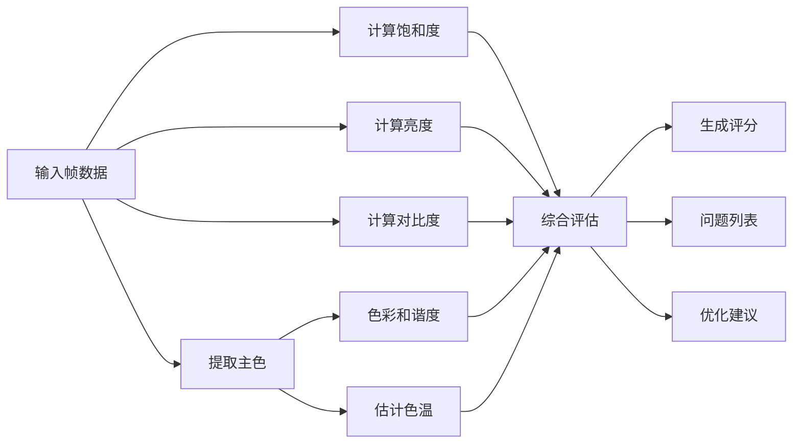

# VidLuxe 分析引擎

## 概述

分析引擎是 VidLuxe 的核心组件，负责对视频内容进行多维度分析。每个维度都有独立的分析器，遵循统一的接口规范。

---

## 分析器接口

### 通用接口定义

```typescript
// packages/types/src/analyzer.ts

export interface Analyzer<T> {
  /**
   * 执行分析
   * @param input 分析输入
   * @returns 分析结果
   */
  analyze(input: AnalyzeInput): Promise<T>;

  /**
   * 计算维度评分
   * @param result 分析结果
   * @returns 0-100 的评分
   */
  getScore(result: T): number;

  /**
   * 提取问题列表
   * @param result 分析结果
   * @returns 问题列表
   */
  getIssues(result: T): Issue[];

  /**
   * 生成优化建议
   * @param result 分析结果
   * @returns 建议列表
   */
  getSuggestions(result: T): Suggestion[];
}

export interface Issue {
  severity: 'critical' | 'warning' | 'info';
  message: string;
  location?: {
    frame?: number;
    region?: { x: number; y: number; width: number; height: number };
  };
}

export interface Suggestion {
  priority: 'high' | 'medium' | 'low';
  message: string;
  autoFixable: boolean;
}
```

---

## 色彩分析器 (ColorAnalyzer)

### 状态：✅ 已实现

色彩分析器分析视频的色彩特征，包括饱和度、亮度、对比度、色彩和谐度等指标。

### 配置选项

```typescript
export interface ColorAnalyzerConfig {
  sampleFrames?: number;      // 采样帧数，默认 30
  histogramBins?: number;     // 直方图桶数，默认 256
  logger?: Console;
}
```

### 核心方法

```typescript
class ColorAnalyzer {
  constructor(config: ColorAnalyzerConfig = {});

  /**
   * 分析单帧
   * 浏览器/Remotion 环境使用
   */
  analyzeFrame(imageData: ImageData): ColorAnalysis;

  /**
   * 分析多帧
   * 视频级别分析
   */
  analyzeFrames(frames: ImageData[]): ColorAnalysis;
}
```

### 分析流程



### 指标说明

#### 1. 饱和度 (Saturation)

```typescript
interface SaturationMetric {
  mean: number;    // 平均饱和度 (0-1)
  std: number;     // 标准差
  highRatio: number; // 高饱和度像素占比
}

// 高级感标准
// - 最佳范围：0.40 - 0.50
// - 可接受范围：0.35 - 0.55
// - 过高：> 0.55 (艳俗)
// - 过低：< 0.35 (平淡)
```

#### 2. 亮度 (Brightness)

```typescript
interface BrightnessMetric {
  mean: number;    // 平均亮度 (0-1)
  std: number;     // 标准差
}

// 使用感知亮度公式
// Y = 0.299*R + 0.587*G + 0.114*B
```

#### 3. 对比度 (Contrast)

```typescript
interface ContrastMetric {
  ratio: number;   // 对比度比率
  score: number;   // 评分 (0-100)
}

// 高级感标准
// - 最佳范围：0.15 - 0.35 (标准差)
// - 过高：画面生硬
// - 过低：画面平淡
```

#### 4. 主色提取 (Dominant Colors)

```typescript
interface RGBColor {
  r: number;
  g: number;
  b: number;
  hex: string;
  name?: string;
}

// 颜色量化 + 去重
// 高级感标准：主色 <= 3 种
```

#### 5. 色彩和谐度 (Color Harmony)

```typescript
// 基于色调差异计算
// 高级感标准：> 0.7

private calculateColorHarmony(colors: RGBColor[]): number {
  if (colors.length < 2) return 1;

  const hues = colors.map(c => this.rgbToHsl(c.r, c.g, c.b).h);
  const mean = hues.reduce((a, b) => a + b, 0) / hues.length;
  const variance = hues.reduce((sum, h) => sum + Math.pow(h - mean, 2), 0) / hues.length;
  const std = Math.sqrt(variance);

  // 标准差越小，颜色越和谐
  if (std < 30) return 0.9 + (30 - std) / 300;
  if (std < 60) return 0.7 + (60 - std) / 100;
  return Math.max(0.3, 0.7 - (std - 60) / 200);
}
```

#### 6. 色温估计 (Color Temperature)

```typescript
// 开尔文 (K)
// - 暖色：< 5000K
// - 中性：5000-6000K
// - 冷色：> 6000K

private estimateColorTemperature(colors: RGBColor[]): number {
  if (colors.length === 0) return 5500;

  const avgR = colors.reduce((sum, c) => sum + c.r, 0) / colors.length;
  const avgB = colors.reduce((sum, c) => sum + c.b, 0) / colors.length;

  const ratio = avgR / (avgB + 1);
  if (ratio > 1.5) return 4500;  // 暖色
  if (ratio < 0.8) return 6500;  // 冷色
  return 5500; // 中性
}
```

#### 7. 帧间一致性 (Color Consistency)

```typescript
// 多帧分析时计算
// 衡量视频色彩风格的统一程度
// 高级感标准：> 0.8

private calculateFrameConsistency(analyses: ColorAnalysis[]): number {
  if (analyses.length < 2) return 1;

  const satMeans = analyses.map(a => a.saturation.mean);
  const brightMeans = analyses.map(a => a.brightness.mean);

  const satVariance = this.calculateVariance(satMeans);
  const brightVariance = this.calculateVariance(brightMeans);

  return Math.max(0, 1 - Math.min(1, (satVariance + brightVariance) * 10));
}
```

### 评分权重

| 指标 | 权重 | 说明 |
|------|------|------|
| 饱和度 | 30% | 核心指标 |
| 颜色数量 | 20% | 克制原则 |
| 色彩和谐度 | 25% | 美感关键 |
| 对比度 | 15% | 层次感 |
| 帧间一致性 | 10% | 风格统一 |

### 使用示例

```typescript
import { ColorAnalyzer } from '@vidluxe/core';

// 浏览器环境
const analyzer = new ColorAnalyzer({
  sampleFrames: 30,
});

// 从 Canvas 获取 ImageData
const canvas = document.getElementById('canvas') as HTMLCanvasElement;
const ctx = canvas.getContext('2d')!;
const imageData = ctx.getImageData(0, 0, canvas.width, canvas.height);

// 单帧分析
const result = analyzer.analyzeFrame(imageData);
console.log('Premium Score:', result.premiumScore);
console.log('Issues:', result.issues);
console.log('Suggestions:', result.suggestions);

// 多帧分析
const frames: ImageData[] = await extractVideoFrames(videoElement, 30);
const videoResult = analyzer.analyzeFrames(frames);
console.log('Consistency:', videoResult.colorConsistency);
```

---

## 排版分析器 (TypographyAnalyzer)

### 状态：🚧 待实现

### 设计规范

```typescript
interface TypographyAnalysis {
  // 字体分析
  fonts: {
    count: number;
    families: FontFamily[];
    sizes: number[];
    weights: number[];
  };

  // 层级分析
  hierarchy: {
    levels: number;
    consistent: boolean;
    ratio: number;  // 层级比例
  };

  // 排版质量
  alignment: 'left' | 'center' | 'right' | 'mixed';
  density: number;  // 文字密度
  readability: number;

  premiumScore: number;
  issues: string[];
  suggestions: string[];
}

interface FontFamily {
  name: string;
  category: 'serif' | 'sans-serif' | 'display' | 'handwriting';
  usage: number;  // 使用频率
}
```

### 高级感标准

| 指标 | 标准 | 说明 |
|------|------|------|
| 字体数量 | ≤ 2 | 字体克制 |
| 字号层级 | 3-5 级 | 层级清晰 |
| 层级比例 | 1.25-1.5 | 黄金比例 |
| 文字密度 | < 30% | 留白充足 |

---

## 构图分析器 (CompositionAnalyzer)

### 状态：🚧 待实现

### 设计规范

```typescript
interface CompositionAnalysis {
  // 规则检测
  rules: {
    ruleOfThirds: number;  // 三分法得分
    goldenRatio: number;   // 黄金分割
    symmetry: number;      // 对称性
    leadingLines: number;  // 引导线
  };

  // 视觉重心
  focusPoints: {
    x: number;
    y: number;
    strength: number;
  }[];

  // 空间分布
  balance: number;  // 平衡度
  negativeSpace: number;  // 负空间占比

  premiumScore: number;
  issues: string[];
  suggestions: string[];
}
```

### 高级感标准

| 规则 | 标准 | 说明 |
|------|------|------|
| 三分法 | > 0.7 | 基础构图 |
| 黄金分割 | > 0.6 | 高级构图 |
| 对称性 | 根据风格 | 极简高，其他适中 |
| 负空间 | > 30% | 留白充足 |

---

## 动效分析器 (MotionAnalyzer)

### 状态：🚧 待实现

### 设计规范

```typescript
interface MotionAnalysis {
  // 运动特征
  motion: {
    intensity: number;     // 运动强度
    direction: string;     // 主要方向
    smoothness: number;    // 流畅度
  };

  // 帧率
  frameRate: {
    actual: number;
    consistent: boolean;
    dropped: number;
  };

  // 转场
  transitions: {
    count: number;
    types: TransitionType[];
    quality: number;
  };

  premiumScore: number;
  issues: string[];
  suggestions: string[];
}

type TransitionType = 'cut' | 'fade' | 'dissolve' | 'wipe' | 'zoom';
```

### 高级感标准

| 指标 | 标准 | 说明 |
|------|------|------|
| 运动流畅度 | > 0.8 | 无卡顿 |
| 帧率稳定 | > 95% | 无掉帧 |
| 转场数量 | < 10/分钟 | 克制使用 |
| 转场类型 | 1-2 种 | 风格统一 |

---

## 音频分析器 (AudioAnalyzer)

### 状态：🚧 待实现

### 设计规范

```typescript
interface AudioAnalysis {
  // 基本特征
  waveform: {
    peak: number;
    rms: number;
    dynamicRange: number;
  };

  // 频谱
  frequency: {
    bass: number;
    mid: number;
    treble: number;
    balance: number;
  };

  // 质量指标
  noise: number;      // 噪声水平
  clarity: number;    // 清晰度
  consistency: number; // 一致性

  premiumScore: number;
  issues: string[];
  suggestions: string[];
}
```

### 高级感标准

| 指标 | 标准 | 说明 |
|------|------|------|
| 动态范围 | 6-12 dB | 适中 |
| 频谱平衡 | > 0.7 | 均衡 |
| 噪声水平 | < -40 dB | 干净 |
| 清晰度 | > 0.8 | 清晰 |

---

## 细节分析器 (DetailAnalyzer)

### 状态：🚧 待实现

### 设计规范

```typescript
interface DetailAnalysis {
  // 分辨率
  resolution: {
    width: number;
    height: number;
    isHD: boolean;
    is4K: boolean;
  };

  // 清晰度
  sharpness: {
    global: number;
    regions: RegionSharpness[];
  };

  // 压缩质量
  compression: {
    artifacts: number;  // 压缩伪影
    bitrate: number;
    codec: string;
  };

  premiumScore: number;
  issues: string[];
  suggestions: string[];
}
```

---

## 统一分析管道

```typescript
// packages/core/src/analyzer/analysis-pipeline.ts

export class AnalysisPipeline {
  private colorAnalyzer: ColorAnalyzer;
  private typographyAnalyzer?: TypographyAnalyzer;
  private compositionAnalyzer?: CompositionAnalyzer;
  private motionAnalyzer?: MotionAnalyzer;
  private audioAnalyzer?: AudioAnalyzer;
  private detailAnalyzer?: DetailAnalyzer;

  constructor(config: PipelineConfig = {}) {
    this.colorAnalyzer = new ColorAnalyzer(config.color);
    // 其他分析器根据需要初始化
  }

  async run(video: VideoInput): Promise<VideoAnalysisOutput> {
    // 提取帧
    const frames = await this.extractFrames(video);

    // 提取音频
    const audio = await this.extractAudio(video);

    // 并行执行各维度分析
    const [color, typography, composition, motion, audioResult, detail] =
      await Promise.all([
        this.colorAnalyzer.analyzeFrames(frames),
        this.typographyAnalyzer?.analyze(frames),
        this.compositionAnalyzer?.analyze(frames),
        this.motionAnalyzer?.analyze(video),
        this.audioAnalyzer?.analyze(audio),
        this.detailAnalyzer?.analyze(video),
      ]);

    return {
      color,
      typography,
      composition,
      motion,
      audio: audioResult,
      detail,
      score: this.calculateTotalScore({
        color,
        typography,
        composition,
        motion,
        audio: audioResult,
        detail,
      }),
      duration: video.duration,
      resolution: video.resolution,
      fps: video.fps,
    };
  }
}
```

---

## 下一步

- [评分引擎](./scorer.md)
- [处理引擎](./processor.md)
- [API 设计](../API.md)
