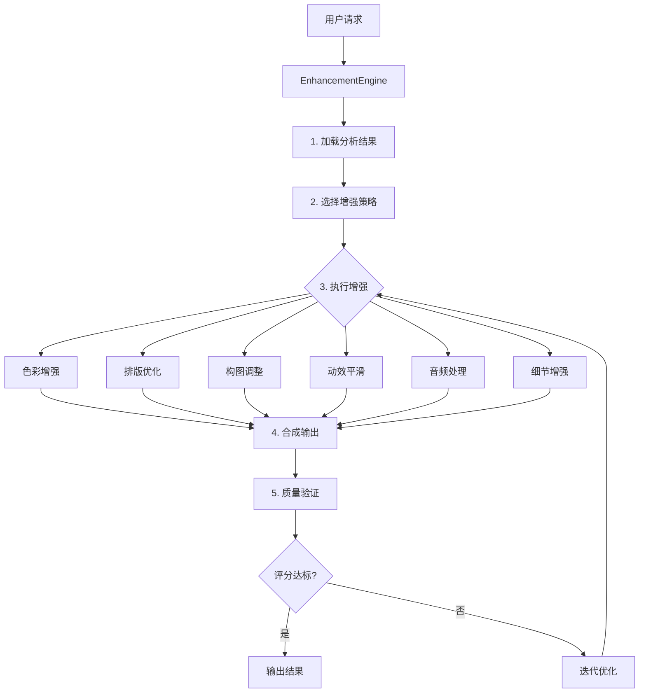

# VidLuxe 增强引擎

## 概述

增强引擎是 VidLuxe 的核心功能模块，负责将分析结果转化为实际的视频增强效果。它协调分析器、处理器和评分器，实现完整的视频增强流程。

---

## 架构设计



---

## 核心接口

### EnhancementEngine

```typescript
// packages/core/src/enhancer/index.ts

import type {
  EnhancementOptions,
  EnhancementResult,
  PremiumProfile,
  PremiumScore,
  VideoAnalysisOutput,
} from '@vidluxe/types';

export interface EnhancementEngineConfig {
  colorProcessor: ColorProcessor;
  videoProcessor: VideoProcessor;
  analyzer: ColorAnalyzer;
  scorer: PremiumScorer;
  maxIterations: number;
  targetScore: number;
}

export class EnhancementEngine {
  private config: EnhancementEngineConfig;

  constructor(config: EnhancementEngineConfig) {
    this.config = config;
  }

  /**
   * 执行视频增强
   */
  async enhance(
    frames: ImageData[],
    analysis: VideoAnalysisOutput,
    options: EnhancementOptions
  ): Promise<EnhancementResult> {
    const profile = this.getProfile(options.style);
    const beforeScore = analysis.score;

    // 1. 执行增强
    const enhancedFrames = await this.applyEnhancements(
      frames,
      analysis,
      profile,
      options
    );

    // 2. 重新分析
    const enhancedAnalysis = this.config.analyzer.analyzeFrames(enhancedFrames);
    const afterScore = this.config.scorer.calculateFromColor(enhancedAnalysis);

    // 3. 检查是否需要迭代
    if (
      afterScore.total < this.config.targetScore &&
      this.config.maxIterations > 1
    ) {
      return this.iterativeEnhance(
        enhancedFrames,
        enhancedAnalysis,
        options,
        1
      );
    }

    // 4. 生成结果
    return {
      success: true,
      output: afterScore,
      changes: this.generateChangeLog(beforeScore, afterScore),
    };
  }

  /**
   * 迭代增强
   */
  private async iterativeEnhance(
    frames: ImageData[],
    analysis: VideoAnalysisOutput,
    options: EnhancementOptions,
    iteration: number
  ): Promise<EnhancementResult> {
    if (iteration >= this.config.maxIterations) {
      // 达到最大迭代次数，返回当前结果
      return this.generateResult(analysis);
    }

    // 增强强度随迭代增加
    const intensifiedOptions: EnhancementOptions = {
      ...options,
      intensity: this.increaseIntensity(options.intensity),
    };

    const enhancedFrames = await this.applyEnhancements(
      frames,
      analysis,
      this.getProfile(options.style),
      intensifiedOptions
    );

    const enhancedAnalysis = this.config.analyzer.analyzeFrames(enhancedFrames);
    const afterScore = this.config.scorer.calculateFromColor(enhancedAnalysis);

    if (afterScore.total >= this.config.targetScore) {
      return {
        success: true,
        output: afterScore,
        changes: this.generateChangeLog(analysis.score, afterScore),
      };
    }

    return this.iterativeEnhance(
      enhancedFrames,
      enhancedAnalysis,
      options,
      iteration + 1
    );
  }

  /**
   * 应用增强效果
   */
  private async applyEnhancements(
    frames: ImageData[],
    analysis: VideoAnalysisOutput,
    profile: PremiumProfile,
    options: EnhancementOptions
  ): Promise<ImageData[]> {
    const intensity = this.getIntensityFactor(options.intensity);

    return frames.map((frame, index) => {
      let processed = frame;

      // 按维度应用增强
      for (const dimension of options.dimensions) {
        processed = this.enhanceDimension(
          processed,
          dimension,
          analysis,
          profile,
          intensity
        );
      }

      return processed;
    });
  }

  /**
   * 单维度增强
   */
  private enhanceDimension(
    frame: ImageData,
    dimension: string,
    analysis: VideoAnalysisOutput,
    profile: PremiumProfile,
    intensity: number
  ): ImageData {
    switch (dimension) {
      case 'color':
        return this.enhanceColor(frame, analysis.color, profile, intensity);

      case 'typography':
        return this.enhanceTypography(frame, analysis.typography, intensity);

      case 'composition':
        return this.enhanceComposition(frame, analysis.composition, intensity);

      case 'motion':
        // 动效增强在帧级别不处理
        return frame;

      case 'audio':
        // 音频增强在帧级别不处理
        return frame;

      case 'detail':
        return this.enhanceDetail(frame, analysis.detail, intensity);

      default:
        return frame;
    }
  }

  // 具体增强方法见下文...
}
```

---

## 色彩增强

### 智能色彩调整

```typescript
// packages/core/src/enhancer/color-enhancer.ts

export class ColorEnhancer {
  private processor: ColorProcessor;
  private analyzer: ColorAnalyzer;

  constructor(processor: ColorProcessor, analyzer: ColorAnalyzer) {
    this.processor = processor;
    this.analyzer = analyzer;
  }

  /**
   * 智能色彩增强
   */
  enhance(
    frame: ImageData,
    currentAnalysis: ColorAnalysis,
    targetProfile: PremiumProfile,
    intensity: number
  ): ImageData {
    // 计算需要的调整量
    const adjustments = this.calculateAdjustments(
      currentAnalysis,
      targetProfile,
      intensity
    );

    let result = frame;

    // 1. 饱和度调整
    if (Math.abs(adjustments.saturation) > 0.01) {
      const targetSat = currentAnalysis.saturation.mean + adjustments.saturation;
      result = this.processor.adjustSaturation(result, targetSat);
    }

    // 2. 对比度调整
    if (Math.abs(adjustments.contrast) > 0.01) {
      result = this.processor.adjustContrast(result, targetProfile.contrast);
    }

    // 3. 色温调整
    if (Math.abs(adjustments.temperature) > 50) {
      result = this.processor.adjustTemperature(result, targetProfile.temperature);
    }

    // 4. 高光/阴影调整
    if (targetProfile.highlights !== 0 || targetProfile.shadows !== 0) {
      result = this.processor.adjustHighlights(result, targetProfile.highlights);
      result = this.processor.adjustShadows(result, targetProfile.shadows);
    }

    return result;
  }

  /**
   * 计算调整量
   */
  private calculateAdjustments(
    current: ColorAnalysis,
    target: PremiumProfile,
    intensity: number
  ): {
    saturation: number;
    contrast: number;
    temperature: number;
  } {
    return {
      saturation: (target.saturation - current.saturation.mean) * intensity,
      contrast: (target.contrast - current.contrast.ratio / 21) * intensity,
      temperature: (target.temperature - current.colorTemperature) * intensity,
    };
  }

  /**
   * 针对问题的定向修复
   */
  fixIssues(
    frame: ImageData,
    issues: string[]
  ): ImageData {
    let result = frame;

    for (const issue of issues) {
      if (issue.includes('饱和度过高')) {
        result = this.processor.adjustSaturation(result, 0.45);
      } else if (issue.includes('饱和度过低')) {
        result = this.processor.adjustSaturation(result, 0.50);
      } else if (issue.includes('对比度过低')) {
        result = this.processor.adjustContrast(result, 0.25);
      } else if (issue.includes('对比度过高')) {
        result = this.processor.adjustContrast(result, 0.15);
      }
    }

    return result;
  }
}
```

---

## 排版优化

### 文字检测与优化

```typescript
// packages/core/src/enhancer/typography-enhancer.ts

export class TypographyEnhancer {
  /**
   * 优化排版
   * 注意：帧级别的排版优化有限，主要用于调整文字层
   */
  enhance(
    frame: ImageData,
    analysis: TypographyAnalysis | undefined,
    intensity: number
  ): ImageData {
    if (!analysis) return frame;

    // 当前为占位实现
    // 实际实现需要：
    // 1. OCR 检测文字区域
    // 2. 分析字体、大小、颜色
    // 3. 应用优化规则

    return frame;
  }

  /**
   * 生成排版优化建议
   */
  generateSuggestions(analysis: TypographyAnalysis): string[] {
    const suggestions: string[] = [];

    if (analysis.fonts.count > 2) {
      suggestions.push(`减少字体种类，当前 ${analysis.fonts.count} 种，建议不超过 2 种`);
    }

    if (analysis.hierarchy.levels > 5) {
      suggestions.push(`简化层级结构，当前 ${analysis.hierarchy.levels} 级，建议 3-5 级`);
    }

    if (analysis.density > 0.3) {
      suggestions.push(`增加留白，当前文字密度 ${(analysis.density * 100).toFixed(0)}%`);
    }

    return suggestions;
  }
}
```

---

## 构图调整

### 智能裁剪与构图

```typescript
// packages/core/src/enhancer/composition-enhancer.ts

export class CompositionEnhancer {
  /**
   * 构图优化
   */
  enhance(
    frame: ImageData,
    analysis: CompositionAnalysis | undefined,
    intensity: number
  ): ImageData {
    if (!analysis) return frame;

    // 当前为占位实现
    // 实际实现需要：
    // 1. 主体检测
    // 2. 智能裁剪
    // 3. 构图规则对齐

    return frame;
  }

  /**
   * 计算最佳裁剪区域
   */
  calculateOptimalCrop(
    frame: ImageData,
    analysis: CompositionAnalysis,
    targetAspect: number
  ): { x: number; y: number; width: number; height: number } {
    // 基于焦点和构图规则计算裁剪
    const focus = analysis.focusPoints[0];
    const frameWidth = frame.width;
    const frameHeight = frame.height;

    // 计算目标尺寸
    let cropWidth: number, cropHeight: number;
    if (targetAspect > frameWidth / frameHeight) {
      cropWidth = frameWidth;
      cropHeight = frameWidth / targetAspect;
    } else {
      cropHeight = frameHeight;
      cropWidth = frameHeight * targetAspect;
    }

    // 以焦点为中心
    let x = focus.x - cropWidth / 2;
    let y = focus.y - cropHeight / 2;

    // 边界检查
    x = Math.max(0, Math.min(frameWidth - cropWidth, x));
    y = Math.max(0, Math.min(frameHeight - cropHeight, y));

    return { x, y, width: cropWidth, height: cropHeight };
  }
}
```

---

## 细节增强

### 锐化与降噪

```typescript
// packages/core/src/enhancer/detail-enhancer.ts

export class DetailEnhancer {
  private denoiser: DenoiseEffect;
  private sharpener: SharpenEffect;

  constructor() {
    this.denoiser = new DenoiseEffect();
    this.sharpener = new SharpenEffect();
  }

  /**
   * 细节增强
   */
  enhance(
    frame: ImageData,
    analysis: DetailAnalysis | undefined,
    intensity: number
  ): ImageData {
    if (!analysis) return frame;

    let result = frame;

    // 1. 降噪（如果有压缩伪影）
    if (analysis.compression.artifacts > 0.3) {
      result = this.denoiser.apply(result, analysis.compression.artifacts * 0.5);
    }

    // 2. 锐化（如果清晰度不足）
    if (analysis.sharpness.global < 0.7) {
      result = this.sharpener.apply(result, (0.7 - analysis.sharpness.global) * intensity);
    }

    return result;
  }
}
```

---

## 增强策略

### 自适应策略选择

```typescript
// packages/core/src/enhancer/strategy.ts

export type EnhancementStrategy =
  | 'conservative'  // 保守策略，轻微调整
  | 'balanced'      // 平衡策略，适度调整
  | 'aggressive';   // 激进策略，大幅调整

export class StrategySelector {
  /**
   * 根据当前评分选择最佳策略
   */
  select(currentScore: PremiumScore): EnhancementStrategy {
    if (currentScore.total >= 75) {
      return 'conservative';  // 已经很好，只需微调
    } else if (currentScore.total >= 55) {
      return 'balanced';      // 中等水平，平衡调整
    } else {
      return 'aggressive';    // 需要大幅改进
    }
  }

  /**
   * 根据策略获取参数
   */
  getParameters(strategy: EnhancementStrategy): {
    intensity: number;
    maxIterations: number;
    targetImprovement: number;
  } {
    const params = {
      conservative: {
        intensity: 0.3,
        maxIterations: 1,
        targetImprovement: 5,
      },
      balanced: {
        intensity: 0.6,
        maxIterations: 2,
        targetImprovement: 15,
      },
      aggressive: {
        intensity: 1.0,
        maxIterations: 3,
        targetImprovement: 25,
      },
    };

    return params[strategy];
  }
}
```

---

## 批量处理

### 任务队列

```typescript
// packages/core/src/enhancer/queue.ts

export interface EnhancementTask {
  id: string;
  projectId: string;
  analysisId: string;
  options: EnhancementOptions;
  status: 'pending' | 'processing' | 'completed' | 'failed';
  progress: number;
  result?: EnhancementResult;
  error?: string;
}

export class EnhancementQueue {
  private tasks: Map<string, EnhancementTask>;
  private processor: EnhancementEngine;

  constructor(processor: EnhancementEngine) {
    this.tasks = new Map();
    this.processor = processor;
  }

  /**
   * 添加任务
   */
  async add(
    projectId: string,
    analysisId: string,
    options: EnhancementOptions
  ): Promise<string> {
    const taskId = `task_${Date.now()}_${Math.random().toString(36).slice(2)}`;

    const task: EnhancementTask = {
      id: taskId,
      projectId,
      analysisId,
      options,
      status: 'pending',
      progress: 0,
    };

    this.tasks.set(taskId, task);

    // 异步执行
    this.execute(taskId).catch(console.error);

    return taskId;
  }

  /**
   * 执行任务
   */
  private async execute(taskId: string): Promise<void> {
    const task = this.tasks.get(taskId);
    if (!task) return;

    task.status = 'processing';

    try {
      // 加载帧和分析结果
      const frames = await this.loadFrames(task.projectId);
      const analysis = await this.loadAnalysis(task.analysisId);

      // 进度回调
      const onProgress = (progress: number) => {
        task.progress = progress;
      };

      // 执行增强
      const result = await this.processor.enhance(frames, analysis, task.options);

      task.status = 'completed';
      task.progress = 100;
      task.result = result;
    } catch (error) {
      task.status = 'failed';
      task.error = error instanceof Error ? error.message : 'Unknown error';
    }
  }

  /**
   * 获取任务状态
   */
  getStatus(taskId: string): EnhancementTask | undefined {
    return this.tasks.get(taskId);
  }
}
```

---

## Remotion 集成

### 视频渲染

```typescript
// packages/remotion/src/enhance-composition.tsx

import { Composition, Sequence, useVideoConfig } from 'remotion';
import { EnhancementEngine } from '@vidluxe/core';

export const EnhancedVideo: React.FC<{
  frames: ImageData[];
  profile: PremiumProfile;
}> = ({ frames, profile }) => {
  const { fps, durationInFrames } = useVideoConfig();

  return (
    <>
      {frames.map((frame, index) => (
        <Sequence from={index} durationInFrames={1} key={index}>
          <EnhancedFrame frame={frame} profile={profile} />
        </Sequence>
      ))}
    </>
  );
};

const EnhancedFrame: React.FC<{
  frame: ImageData;
  profile: PremiumProfile;
}> = ({ frame, profile }) => {
  const canvasRef = useRef<HTMLCanvasElement>(null);

  useEffect(() => {
    const canvas = canvasRef.current;
    if (!canvas) return;

    const ctx = canvas.getContext('2d');
    if (!ctx) return;

    // 应用增强
    const engine = new EnhancementEngine(/* config */);
    const enhanced = engine.enhanceColor(frame, profile, 0.8);

    ctx.putImageData(enhanced, 0, 0);
  }, [frame, profile]);

  return (
    <canvas
      ref={canvasRef}
      width={frame.width}
      height={frame.height}
    />
  );
};
```

---

## 使用示例

### 完整流程

```typescript
import {
  ColorAnalyzer,
  PremiumScorer,
  EnhancementEngine,
  ColorProcessorImpl,
  VideoProcessorImpl,
} from '@vidluxe/core';
import { PREMIUM_PROFILES } from '@vidluxe/types';

// 1. 初始化组件
const colorProcessor = new ColorProcessorImpl();
const videoProcessor = new VideoProcessorImpl({
  colorProcessor,
  analyzer: new ColorAnalyzer(),
  scorer: new PremiumScorer(),
});

const engine = new EnhancementEngine({
  colorProcessor,
  videoProcessor,
  analyzer: new ColorAnalyzer(),
  scorer: new PremiumScorer(),
  maxIterations: 3,
  targetScore: 85,
});

// 2. 加载视频帧
const frames = await extractVideoFrames(videoFile);

// 3. 分析
const analyzer = new ColorAnalyzer();
const analysis = {
  color: analyzer.analyzeFrames(frames),
  // 其他维度...
};

// 4. 增强
const result = await engine.enhance(frames, analysis, {
  style: 'minimal',
  intensity: 'medium',
  dimensions: ['color'],
});

// 5. 检查结果
console.log('Before:', analysis.score.total);
console.log('After:', result.output?.total);
console.log('Improvement:', result.changes);
```

---

## 下一步

- [部署方案](../DEPLOYMENT.md)
- [测试策略](../TESTING.md)
- [API 设计](../API.md)
