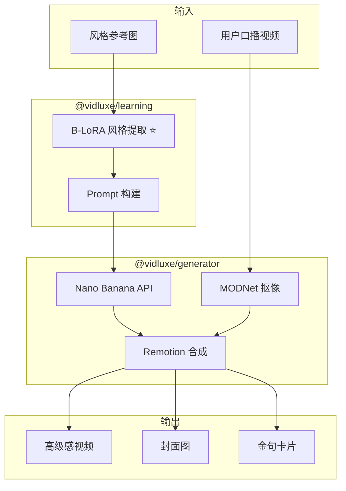

# VidLuxe AI 素材生成引擎

## 概述

AI 素材生成引擎是 VidLuxe 的核心价值创造模块，采用**渐进式混合架构**，MVP 阶段以 Nano Banana API 为主，逐步过渡到自建 SDXL + B-LoRA。

> **核心理念**："先用成熟 API 快速验证商业价值，再逐步自建技术壁垒"

---

## 渐进式技术方案

### MVP 阶段（当前）

```
素材生成：Nano Banana API
├─ 优势：快速、稳定、无需 GPU
├─ 成本：~$0.15/图
├─ 速度：1-2 秒/图
└─ 限制：API 依赖

人物抠像：MODNet API
├─ 优势：成熟、效果好
└─ 成本：~$0.03/视频

视频合成：Remotion Lambda
├─ 优势：React-based、可编程
└─ 成本：~$0.05/视频

总成本：~$0.25/视频（约 ¥1.8）
```

### 标准阶段（3-6 月后）

```
素材生成：SDXL + B-LoRA（自部署）
├─ 成本：~$0.03/图（-80%）
├─ 需要：GPU 推理
└─ 部署：Modal/Replicate

视频风格：+ AnimateDiff
├─ 时序一致性更好
└─ 风格迁移更自然

总成本：~$0.10/视频（约 ¥0.7）
```

### 专业阶段（6-12 月后）

```
全流程：ComfyUI 工作流
├─ 完全可控
├─ 自训练模型
└─ 差异化壁垒

总成本：~$0.05/视频（规模效应）
```

---

## 产品价值

### 原方案 vs 新方案

| 维度 | 原方案（参数调整） | 新方案（AI 生成） |
|------|-------------------|------------------|
| **效果可见性** | ⚠️ 微调 | ✅ 质变 |
| **节省时间** | ❌ 不明显 | ✅ 3小时→5分钟 |
| **替代方案** | 剪映免费 | ❌ 无直接替代 |
| **使用频率** | ⚠️ 偶尔 | ✅ 每周 3-5 次 |
| **价值感知** | ⚠️ 不清晰 | ✅ 看得见的高级 |

### 用户体验升级

```
用户输入：口播视频 + 选择风格参考图
    ↓
AI 处理（MVP）：
├─ B-LoRA 从参考图学习风格 ⭐
├─ MODNet 人物抠像
├─ Nano Banana 生成高级感背景
├─ 提取关键文字 → 生成金句卡片
├─ Remotion 智能合成
    ↓
输出：
├─ 高级感口播视频
├─ 配套封面图
└─ 金句卡片素材

价值：从"能用"到"惊艳"
```

---

## 技术架构

### MVP 阶段架构



### 模块划分

```
packages/generator/
├── src/
│   ├── analyzer/              # 内容分析
│   │   ├── content-analyzer.ts
│   │   ├── keyword-extractor.ts
│   │   └── mood-detector.ts
│   │
│   ├── prompt/                # Prompt 工程
│   │   ├── prompt-builder.ts
│   │   ├── templates/
│   │   │   ├── minimal.ts
│   │   │   ├── warm-luxury.ts
│   │   │   ├── cool-professional.ts
│   │   │   └── morandi.ts
│   │   └── index.ts
│   │
│   ├── generator/             # 素材生成
│   │   ├── asset-generator.ts
│   │   ├── nano-banana-client.ts
│   │   ├── background-generator.ts
│   │   ├── text-card-generator.ts
│   │   └── cover-generator.ts
│   │
│   ├── segmenter/             # 人物抠像
│   │   ├── segmenter.ts
│   │   ├── rembg-adapter.ts
│   │   └── modnet-adapter.ts
│   │
│   ├── composer/              # 视频合成
│   │   ├── video-composer.ts
│   │   ├── remotion-templates/
│   │   │   ├── talking-head.tsx
│   │   │   ├── product-showcase.tsx
│   │   │   └── knowledge-share.tsx
│   │   └── audio-mixer.ts
│   │
│   └── index.ts
│
├── assets/                    # 静态资源
│   ├── fonts/
│   └── music/
│
└── package.json
```

---

## 核心模块设计

### 1. 内容分析器 (ContentAnalyzer)

```typescript
// packages/generator/src/analyzer/content-analyzer.ts

export interface ContentAnalysis {
  // 内容类型
  type: 'talking_head' | 'product_showcase' | 'knowledge_share';

  // 关键词提取
  keywords: string[];

  // 情绪基调
  mood: 'professional' | 'warm' | 'inspiring' | 'calm' | 'energetic';

  // 推荐风格
  recommendedStyle: PremiumStyle;

  // 金句提取
  keyPoints: Array<{
    text: string;
    timestamp: number;
    emphasis: number;  // 强调程度 0-1
  }>;
}

export class ContentAnalyzer {
  /**
   * 分析用户输入内容
   */
  async analyze(input: UserInput): Promise<ContentAnalysis> {
    // 1. 判断内容类型
    const type = await this.detectContentType(input);

    // 2. 提取关键词
    const keywords = await this.extractKeywords(input);

    // 3. 分析情绪基调
    const mood = await this.detectMood(input);

    // 4. 推荐匹配风格
    const recommendedStyle = this.recommendStyle(type, mood);

    // 5. 提取金句
    const keyPoints = await this.extractKeyPoints(input);

    return {
      type,
      keywords,
      mood,
      recommendedStyle,
      keyPoints,
    };
  }

  /**
   * 从口播视频中提取关键内容
   */
  private async extractKeyPoints(input: UserInput): Promise<KeyPoint[]> {
    if (!input.transcript) return [];

    // 使用 LLM 提取核心观点
    const points = await this.llmClient.extractKeyPoints(input.transcript, {
      maxPoints: 5,
      minLength: 10,
      maxLength: 30,
    });

    return points;
  }
}
```

### 2. Prompt 构建器 (PromptBuilder)

```typescript
// packages/generator/src/prompt/prompt-builder.ts

export interface GenerationPrompt {
  background: string;
  textCard: string;
  cover: string;
  style: PremiumStyle;
}

export class PromptBuilder {
  private templates: Record<PremiumStyle, PromptTemplates>;

  constructor() {
    this.templates = {
      minimal: MINIMAL_PROMPTS,
      warm_luxury: WARM_LUXURY_PROMPTS,
      cool_professional: COOL_PROFESSIONAL_PROMPTS,
      morandi: MORANDI_PROMPTS,
    };
  }

  /**
   * 构建生成 Prompt
   */
  build(analysis: ContentAnalysis, style: PremiumStyle): GenerationPrompt {
    const template = this.templates[style];

    return {
      background: this.interpolate(template.background, {
        topic: analysis.keywords.join(', '),
        mood: analysis.mood,
      }),
      textCard: this.interpolate(template.textCard, {
        style: style,
      }),
      cover: this.interpolate(template.cover, {
        keywords: analysis.keywords.slice(0, 3).join(', '),
      }),
      style,
    };
  }

  private interpolate(template: string, vars: Record<string, string>): string {
    return template.replace(/\{(\w+)\}/g, (_, key) => vars[key] || '');
  }
}
```

### 3. 高级感 Prompt 模板

```typescript
// packages/generator/src/prompt/templates/minimal.ts

export const MINIMAL_PROMPTS = {
  background: `
Create a premium minimalist background for {topic} content.
- Deep charcoal (#1A1A1A) to soft gray (#E5E5E5) gradient
- Subtle geometric pattern, very low opacity (< 10%)
- Soft blue accent light (#4A90A4)
- Apple keynote aesthetic
- 4K resolution, aspect ratio 9:16
- 60% negative space minimum
- No text, no logos, no people
- Calm, trustworthy, professional feeling
  `.trim(),

  textCard: `
Design a premium text card for key insights.
- Clean sans-serif font (SF Pro / PingFang SC)
- Generous letter spacing (0.08-0.12em)
- White text on dark background (#1A1A1A)
- Subtle glass morphism effect
- Single accent color: muted orange (#FF6B35)
- Maximum 3 lines, 15 characters per line
- Professional, trustworthy, minimal feeling
  `.trim(),

  cover: `
Create a premium cover image for {keywords} content.
- Clean, minimal composition
- Strong visual hierarchy
- Professional color palette
- Eye-catching but not loud
- Suitable for Xiaohongshu / Instagram
  `.trim(),
};

// packages/generator/src/prompt/templates/warm-luxury.ts

export const WARM_LUXURY_PROMPTS = {
  background: `
Create a luxurious warm-toned background.
- Warm beige (#E8D5B7) to deep brown (#3D2914) gradient
- Subtle marble texture
- Gold accent touches (#C9A962)
- Chanel / Dior campaign aesthetic
- 4K resolution, aspect ratio 9:16
- Elegant, sophisticated, premium feeling
  `.trim(),

  textCard: `
Design an elegant luxury text card.
- Serif font for titles (Playfair Display / Source Serif)
- Gold accent on key words
- Cream background (#F5F0E8)
- Generous margins
- Maximum 2 lines
- Timeless, elegant feeling
  `.trim(),

  cover: `
Create a luxurious cover image.
- Rich, warm color palette
- Premium texture (marble, silk, gold)
- Elegant typography
- High-end brand feeling
  `.trim(),
};

// packages/generator/src/prompt/templates/morandi.ts

export const MORANDI_PROMPTS = {
  background: `
Create a Morandi-style aesthetic background.
- Muted sage green (#A8B5A0)
- Dusty pink (#D4A5A5)
- Warm gray (#B8B4A8)
- Soft, diffused lighting
- Kinfolk magazine aesthetic
- 4K resolution, aspect ratio 9:16
- Calming, sophisticated, organic feeling
  `.trim(),

  textCard: `
Design a Morandi-style text card.
- Light serif font
- Earthy accent colors
- Soft shadows
- Generous white space
- Warm, approachable feeling
  `.trim(),

  cover: `
Create a Morandi-style cover image.
- Soft, muted colors
- Natural, organic composition
- Lifestyle magazine aesthetic
- Warm and inviting
  `.trim(),
};
```

### 4. 素材生成器 (AssetGenerator)

```typescript
// packages/generator/src/generator/asset-generator.ts

import { NanoBananaClient } from './nano-banana-client';

export interface GeneratedAssets {
  backgrounds: ImageAsset[];
  textCards: ImageAsset[];
  cover: ImageAsset;
  styleLUT: ColorLUT;
}

export interface ImageAsset {
  id: string;
  url: string;
  width: number;
  height: number;
  format: 'png' | 'webp';
  metadata: {
    prompt: string;
    style: PremiumStyle;
    generatedAt: Date;
  };
}

export class AssetGenerator {
  private nanoBanana: NanoBananaClient;
  private promptBuilder: PromptBuilder;

  constructor(config: { apiKey: string }) {
    this.nanoBanana = new NanoBananaClient(config.apiKey);
    this.promptBuilder = new PromptBuilder();
  }

  /**
   * 生成所有素材
   */
  async generate(
    analysis: ContentAnalysis,
    style: PremiumStyle
  ): Promise<GeneratedAssets> {
    const prompts = this.promptBuilder.build(analysis, style);

    // 并行生成所有素材
    const [backgrounds, textCards, cover] = await Promise.all([
      this.generateBackgrounds(prompts.background, 3),
      this.generateTextCards(analysis.keyPoints, prompts.textCard),
      this.generateCover(prompts.cover),
    ]);

    // 生成调色 LUT
    const styleLUT = await this.generateStyleLUT(style);

    return {
      backgrounds,
      textCards,
      cover,
      styleLUT,
    };
  }

  /**
   * 生成背景图
   */
  private async generateBackgrounds(
    prompt: string,
    count: number
  ): Promise<ImageAsset[]> {
    const images = await this.nanoBanana.generateImages({
      prompt,
      count,
      size: { width: 1080, height: 1920 },  // 9:16
      quality: 'high',
    });

    return images.map((img, i) => ({
      id: `bg_${Date.now()}_${i}`,
      url: img.url,
      width: 1080,
      height: 1920,
      format: 'webp',
      metadata: {
        prompt,
        style: 'selected',
        generatedAt: new Date(),
      },
    }));
  }

  /**
   * 生成文字卡片
   */
  private async generateTextCards(
    keyPoints: KeyPoint[],
    promptTemplate: string
  ): Promise<ImageAsset[]> {
    const cards: ImageAsset[] = [];

    for (const point of keyPoints) {
      const prompt = promptTemplate.replace('{text}', point.text);
      const [image] = await this.nanoBanana.generateImages({
        prompt,
        count: 1,
        size: { width: 1080, height: 600 },
        quality: 'high',
      });

      cards.push({
        id: `card_${Date.now()}_${point.timestamp}`,
        url: image.url,
        width: 1080,
        height: 600,
        format: 'webp',
        metadata: {
          prompt,
          style: 'selected',
          generatedAt: new Date(),
        },
      });
    }

    return cards;
  }

  /**
   * 生成封面图
   */
  private async generateCover(prompt: string): Promise<ImageAsset> {
    const [image] = await this.nanoBanana.generateImages({
      prompt,
      count: 1,
      size: { width: 1080, height: 1440 },  // 3:4 小红书封面
      quality: 'high',
    });

    return {
      id: `cover_${Date.now()}`,
      url: image.url,
      width: 1080,
      height: 1440,
      format: 'webp',
      metadata: {
        prompt,
        style: 'selected',
        generatedAt: new Date(),
      },
    };
  }
}
```

### 5. Nano Banana 客户端

```typescript
// packages/generator/src/generator/nano-banana-client.ts

/**
 * Nano Banana API 客户端
 * 官网: https://www.nano-banana.com/
 * 特点: 快速生成、高保真文字渲染、4K 输出
 */
export class NanoBananaClient {
  private apiKey: string;
  private baseUrl = 'https://api.nano-banana.com/v1';

  constructor(apiKey: string) {
    this.apiKey = apiKey;
  }

  /**
   * 生成图片
   */
  async generateImages(params: {
    prompt: string;
    count: number;
    size: { width: number; height: number };
    quality: 'standard' | 'high';
  }): Promise<Array<{ url: string; seed: number }>> {
    const response = await fetch(`${this.baseUrl}/generate`, {
      method: 'POST',
      headers: {
        'Content-Type': 'application/json',
        'Authorization': `Bearer ${this.apiKey}`,
      },
      body: JSON.stringify({
        prompt: params.prompt,
        n: params.count,
        size: `${params.size.width}x${params.size.height}`,
        quality: params.quality,
        response_format: 'url',
      }),
    });

    if (!response.ok) {
      throw new Error(`Nano Banana API error: ${response.statusText}`);
    }

    const data = await response.json();
    return data.data.map((item: any) => ({
      url: item.url,
      seed: item.seed,
    }));
  }

  /**
   * 生成带文字的图片
   */
  async generateWithText(params: {
    backgroundImage?: string;
    text: string;
    style: PremiumStyle;
    size: { width: number; height: number };
  }): Promise<{ url: string }> {
    // Nano Banana 支持高保真文字渲染
    const response = await fetch(`${this.baseUrl}/generate-text`, {
      method: 'POST',
      headers: {
        'Content-Type': 'application/json',
        'Authorization': `Bearer ${this.apiKey}`,
      },
      body: JSON.stringify({
        background_image: params.backgroundImage,
        text: params.text,
        style: params.style,
        size: `${params.size.width}x${params.size.height}`,
      }),
    });

    const data = await response.json();
    return { url: data.url };
  }
}
```

### 6. 人物抠像 (Segmenter)

```typescript
// packages/generator/src/segmenter/segmenter.ts

export interface SegmentationResult {
  foreground: ImageData;    // 人物前景
  mask: ImageData;          // 蒙版
  alpha: ImageData;         // Alpha 通道
}

export class Segmenter {
  private model: 'rembg' | 'modnet';

  constructor(model: 'rembg' | 'modnet' = 'rembg') {
    this.model = model;
  }

  /**
   * 从视频中分离人物
   */
  async segmentFrames(frames: ImageData[]): Promise<SegmentationResult[]> {
    const results: SegmentationResult[] = [];

    for (const frame of frames) {
      const result = await this.segmentFrame(frame);
      results.push(result);
    }

    // 时间平滑处理，确保帧间一致性
    return this.temporalSmoothing(results);
  }

  /**
   * 单帧分割
   */
  private async segmentFrame(frame: ImageData): Promise<SegmentationResult> {
    switch (this.model) {
      case 'rembg':
        return this.segmentWithRembg(frame);
      case 'modnet':
        return this.segmentWithModnet(frame);
    }
  }

  /**
   * 时间平滑处理
   */
  private temporalSmoothing(results: SegmentationResult[]): SegmentationResult[] {
    // 对蒙版进行时间上的平滑，避免抖动
    const smoothed = [...results];

    for (let i = 1; i < results.length - 1; i++) {
      const prev = results[i - 1].mask;
      const curr = results[i].mask;
      const next = results[i + 1].mask;

      // 加权平均
      smoothed[i].mask = this.blendMasks(prev, curr, next, 0.25, 0.5, 0.25);
    }

    return smoothed;
  }
}
```

### 7. 视频合成器 (VideoComposer)

```typescript
// packages/generator/src/composer/video-composer.ts

import { Composition, Sequence, AbsoluteFill, Video, Img, useVideoConfig } from 'remotion';

export interface CompositionConfig {
  duration: number;           // 视频时长（秒）
  fps: number;
  width: number;
  height: number;
}

export class VideoComposer {
  /**
   * 合成口播视频
   */
  async composeTalkingHead(params: {
    personFrames: SegmentationResult[];
    backgrounds: ImageAsset[];
    textCards: ImageAsset[];
    audio?: string;
    style: PremiumStyle;
    config: CompositionConfig;
  }): Promise<string> {
    // 使用 Remotion 进行视频合成
    const compositionId = `talking-head-${Date.now()}`;

    await renderVideo({
      compositionId,
      component: TalkingHeadComposition,
      inputProps: params,
      config: params.config,
    });

    return getOutputUrl(compositionId);
  }
}

/**
 * Remotion 模板：口播视频
 */
const TalkingHeadComposition: React.FC<{
  personFrames: SegmentationResult[];
  backgrounds: ImageAsset[];
  textCards: ImageAsset[];
  style: PremiumStyle;
}> = ({ personFrames, backgrounds, textCards, style }) => {
  const { fps, durationInFrames } = useVideoConfig();

  return (
    <AbsoluteFill>
      {/* 背景 */}
      <AbsoluteFill>
        
      </AbsoluteFill>

      {/* 人物 */}
      <AbsoluteFill>
        <Video
          src={personFrames}
          style={{
            width: style.personWidth,
            transform: `translateY(${style.personY})`,
          }}
        />
      </AbsoluteFill>

      {/* 文字卡片（按时间线显示） */}
      {textCards.map((card, index) => (
        <Sequence
          key={card.id}
          from={index * fps * 5}  // 每 5 秒一个卡片
          durationInFrames={fps * 3}  // 显示 3 秒
        >
          <motion.div
            initial={{ opacity: 0, y: 50 }}
            animate={{ opacity: 1, y: 0 }}
            exit={{ opacity: 0, y: -50 }}
            transition={{ duration: 0.5, easing: 'ease-out' }}
            style={{
              position: 'absolute',
              bottom: '20%',
              left: '50%',
              transform: 'translateX(-50%)',
            }}
          >
            
          </motion.div>
        </Sequence>
      ))}
    </AbsoluteFill>
  );
};
```

---

## 三大核心场景

### 场景1：口播视频高级化

```
用户输入：
├─ 口播视频（人物说话，背景杂乱）
└─ 选择风格：Apple极简

AI 处理：
├─ Step 1: 人物抠像（去除原背景）
├─ Step 2: 提取语音关键内容
├─ Step 3: Nano Banana 生成极简背景
│          "深灰渐变 + 柔和蓝色光 + 大量留白"
├─ Step 4: 提取金句 → 生成高级感卡片
├─ Step 5: 应用 Apple 风格调色
└─ Step 6: Remotion 合成

输出：
├─ 高级感口播视频
├─ 小红书封面图
└─ 3-5 张金句卡片
```

### 场景2：产品展示视频

```
用户输入：
├─ 产品照片（手机拍摄，白底）
├─ 产品描述："高端护肤精华"
└─ 选择风格：奢华暖调

AI 处理：
├─ Step 1: 产品抠图
├─ Step 2: 分析产品特点
├─ Step 3: Nano Banana 生成奢华场景
│          "大理石纹理 + 金色点缀 + 柔光"
├─ Step 4: 生成产品特点卡片
├─ Step 5: 添加高级感动效
└─ Step 6: 合成产品展示视频

输出：
├─ 高级感产品视频
├─ 多场景版本
└─ 产品卡片素材
```

### 场景3：知识分享视频

```
用户输入：
├─ 文字稿："5个理财习惯"
└─ 选择风格：专业冷调

AI 处理：
├─ Step 1: 提取关键观点
├─ Step 2: Nano Banana 生成配图
│          "深蓝渐变 + 几何图形 + 专业感"
├─ Step 3: 生成观点卡片
├─ Step 4: 匹配背景音乐
└─ Step 5: 合成知识视频

输出：
├─ 高级感知识视频
├─ 金句卡片
└─ 封面图
```

---

## 成本分析

### 单视频成本

```
每个视频的 AI 调用成本：

Nano Banana 生成：
├─ 背景图 × 3 张 × $0.02 = $0.06
├─ 文字卡片 × 5 张 × $0.02 = $0.10
└─ 封面图 × 1 张 × $0.02 = $0.02
小计：$0.18 ≈ ¥1.3

视频处理：
├─ 抠像处理 ≈ ¥0.3
├─ Remotion 渲染 ≈ ¥0.5
└─ 存储/带宽 ≈ ¥0.2
小计：¥1.0

总成本 ≈ ¥2.3 / 视频
```

### 盈利模型

```
定价：¥99/月

用户每月 20 视频：
├─ 成本：20 × ¥2.3 = ¥46
├─ 收入：¥99
└─ 利润：¥53（毛利率 53%）

用户每月 50 视频（高频用户）：
├─ 成本：50 × ¥2.3 = ¥115
├─ 收入：¥99
└─ 亏损：¥16（需限制或升级套餐）
```

---

## 与其他模块集成

### 与 @vidluxe/learning 集成

```typescript
import { StyleMatcher, FeatureExtractor } from '@vidluxe/learning';
import { AssetGenerator, VideoComposer } from '@vidluxe/generator';

// 完整流程
async function generatePremiumVideo(input: UserInput) {
  // 1. 学习引擎：风格匹配
  const matcher = new StyleMatcher();
  const styleMatch = await matcher.match(input.frames);

  // 2. 生成引擎：素材生成
  const generator = new AssetGenerator(config);
  const assets = await generator.generate(
    input.analysis,
    styleMatch.reference.style
  );

  // 3. 生成引擎：视频合成
  const composer = new VideoComposer();
  const video = await composer.composeTalkingHead({
    personFrames: input.segmentedFrames,
    backgrounds: assets.backgrounds,
    textCards: assets.textCards,
    style: styleMatch.reference.style,
    config: { duration: 60, fps: 30, width: 1080, height: 1920 },
  });

  return video;
}
```

---

## 实施路线图

### Phase 1: 基础设施 (2 周)

- [ ] 创建 `@vidluxe/generator` 包结构
- [ ] 注册 Nano Banana API 账号
- [ ] 实现基础 Prompt 模板

### Phase 2: 核心生成 (3 周)

- [ ] 实现 AssetGenerator
- [ ] 实现 PromptBuilder
- [ ] 实现 NanoBananaClient

### Phase 3: 视频合成 (3 周)

- [ ] 实现 Segmenter
- [ ] 实现 Remotion 模板
- [ ] 实现 VideoComposer

### Phase 4: 优化迭代 (2 周)

- [ ] 性能优化
- [ ] 质量调优
- [ ] 用户测试

---

## 下一步

- [AI 学习引擎](./learning.md) - 风格学习与匹配
- [系统架构设计](../ARCHITECTURE.md) - 整体架构
- [实施评估报告](../EVALUATION.md) - 实施方案
