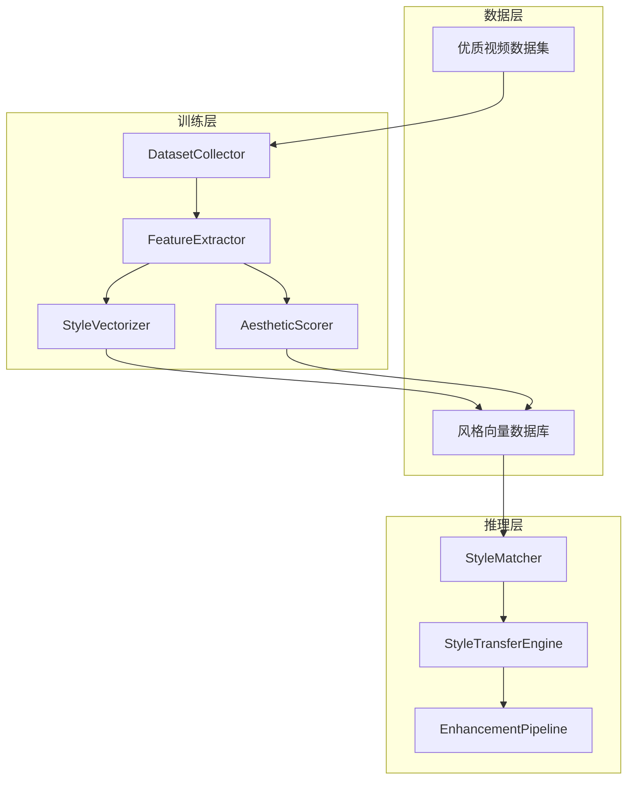

# VidLuxe AI 学习引擎

## 概述

AI 学习引擎是 VidLuxe 高级感引擎的核心组成部分，采用 **B-LoRA** 作为核心风格学习技术，实现单图风格学习与迁移。

> **渐进式方案核心**：MVP 阶段采用 B-LoRA + Nano Banana 混合架构，标准阶段逐步过渡到自建 SDXL。

---

## 渐进式技术方案

### MVP 阶段（当前）

```
风格学习：B-LoRA（单图学习）⭐ 核心技术
├─ 来源：https://github.com/yardenfren1996/B-LoRA
├─ 特点：单张参考图即可学习风格
├─ 论文：ECCV 2024
└─ 集成：ComfyUI-B-LoRA 节点

素材生成：Nano Banana API
├─ 快速生成，无需 GPU
├─ 成本可控
└─ 效果稳定

工作流：
用户上传参考图 → B-LoRA 提取风格 → 风格嵌入 → Nano Banana 生成
```

### 标准阶段（3-6 月后）

```
风格学习：B-LoRA（保持）
素材生成：SDXL + B-LoRA（自部署，成本降低 70%）
视频风格：+ AnimateDiff（时序一致性）
```

---

## B-LoRA 核心概念

### 什么是 B-LoRA？

```
B-LoRA = Block-wise Low-Rank Adaptation

核心能力：
1. 从单张图片学习风格
2. 隐式分离风格和内容
3. 可将学到的风格应用到任意内容

技术原理：
├─ 基于 SDXL + LoRA
├─ 发现两个关键块（B-LoRA blocks）
├─ 联合训练实现风格-内容分离
└─ ECCV 2024 论文验证
```

### B-LoRA vs 原方案

| 维度 | 原方案 (CLIP + NIMA) | B-LoRA |
|------|---------------------|--------|
| **学习方式** | 需要大量样本库 | 单张图片 |
| **风格理解** | 向量相似度 | 深度特征提取 |
| **迁移质量** | ⭐⭐⭐ | ⭐⭐⭐⭐⭐ |
| **实现复杂度** | 高（数据库+检索） | 低（模型加载） |
| **GPU 需求** | 低 | 中（推理） |
| **成本** | API 费用 | 推理费用 |

---

## 模块设计

### MVP 阶段模块结构

```
packages/learning/
├── src/
│   ├── blora/                    # B-LoRA 核心 🆕
│   │   ├── blora-loader.ts       # 模型加载
│   │   ├── style-extractor.ts    # 风格提取
│   │   ├── style-embedding.ts    # 风格嵌入
│   │   └── index.ts
│   │
│   ├── analyzer/                 # 内容分析
│   │   ├── content-analyzer.ts
│   │   └── keyword-extractor.ts
│   │
│   └── index.ts
│
├── models/                       # 模型文件
│   └── blora/                    # B-LoRA 权重
│
└── package.json
```

### 核心模块：BLoRALoader

```typescript
// packages/learning/src/blora/blora-loader.ts

/**
 * B-LoRA 模型加载器
 * 参考：https://github.com/yardenfren1996/B-LoRA
 */
export class BLoRALoader {
  private model: SDXLModel;
  private contentBLora: LoRAWeights;
  private styleBLora: LoRAWeights;

  /**
   * 加载 B-LoRA 模型
   * 可选方式：
   * 1. 本地加载（需要 GPU）
   * 2. Modal/Replicate 托管（推荐 MVP）
   */
  async loadModel(options: {
    method: 'local' | 'modal' | 'replicate';
    modelPath?: string;
  }): Promise<void> {
    switch (options.method) {
      case 'local':
        // 本地加载 SDXL + B-LoRA
        this.model = await loadSDXL();
        break;
      case 'modal':
        // Modal 托管
        this.model = new ModalClient('b-lora');
        break;
      case 'replicate':
        // Replicate API
        this.model = new ReplicateClient('b-lora');
        break;
    }
  }

  /**
   * 从单张图片提取风格
   * 这是 B-LoRA 的核心能力
   */
  async extractStyle(referenceImage: ImageData): Promise<StyleEmbedding> {
    // 1. 加载参考图片
    // 2. 训练/提取 B-LoRA 权重
    // 3. 返回风格嵌入

    const styleEmbedding = await this.model.extractStyle(referenceImage);

    return {
      id: generateId(),
      vector: styleEmbedding.vector,
      contentWeight: styleEmbedding.contentWeight,
      styleWeight: styleEmbedding.styleWeight,
      metadata: {
        sourceImage: referenceImage,
        extractedAt: new Date(),
      },
    };
  }
}
```

### 核心模块：StyleExtractor

```typescript
// packages/learning/src/blora/style-extractor.ts

export interface StyleEmbedding {
  id: string;
  vector: number[];
  contentWeight: number;   // 内容权重 (0-1)
  styleWeight: number;     // 风格权重 (0-1)
  metadata: {
    sourceImage: ImageData;
    extractedAt: Date;
  };
}

export class StyleExtractor {
  private loader: BLoRALoader;

  constructor(loader: BLoRALoader) {
    this.loader = loader;
  }

  /**
   * 从参考图提取高级感风格
   * 支持 4 种预设风格
   */
  async extractPremiumStyle(
    referenceImage: ImageData,
    styleType: PremiumStyle
  ): Promise<StyleEmbedding> {
    // 提取风格嵌入
    const embedding = await this.loader.extractStyle(referenceImage);

    // 根据风格类型调整权重
    const adjusted = this.adjustWeightsForStyle(embedding, styleType);

    return adjusted;
  }

  /**
   * 根据预设风格调整权重
   */
  private adjustWeightsForStyle(
    embedding: StyleEmbedding,
    style: PremiumStyle
  ): StyleEmbedding {
    const styleWeights: Record<PremiumStyle, { style: number; content: number }> = {
      minimal: { style: 0.7, content: 0.3 },
      warm_luxury: { style: 0.8, content: 0.2 },
      cool_professional: { style: 0.75, content: 0.25 },
      morandi: { style: 0.85, content: 0.15 },
    };

    const weights = styleWeights[style];
    return {
      ...embedding,
      styleWeight: weights.style,
      contentWeight: weights.content,
    };
  }
}
```

---

## 与生成引擎集成

### MVP 阶段工作流

```typescript
import { StyleExtractor } from '@vidluxe/learning';
import { NanoBananaGenerator, PromptBuilder } from '@vidluxe/generator';

async function generatePremiumVideo(input: {
  userVideo: Video;
  referenceImage: ImageData;  // 用户选择的风格参考图
  style: PremiumStyle;
}) {
  // 1. B-LoRA 提取风格
  const styleExtractor = new StyleExtractor(bLoRALoader);
  const styleEmbedding = await styleExtractor.extractPremiumStyle(
    input.referenceImage,
    input.style
  );

  // 2. 构建 Prompt
  const promptBuilder = new PromptBuilder();
  const prompt = promptBuilder.build(styleEmbedding, input.style);

  // 3. Nano Banana 生成素材
  const generator = new NanoBananaGenerator();
  const assets = await generator.generate({
    prompt,
    count: { backgrounds: 3, textCards: 5 },
  });

  // 4. Remotion 合成视频
  // ... 见 generator.md

  return { video, assets };
}
```
const assets = await generator.generate({
  style: styleMatch.reference,
  content: contentAnalysis,
  prompts: PREMIUM_PROMPTS.minimal,
});

// 3. 合成：Remotion 渲染
const video = await composer.render(assets);
```

---

## 参考项目

基于 GitHub 最佳实践，我们参考以下开源项目：

| 项目 | Stars | 用途 | 采纳度 |
|------|-------|------|--------|
| [idealo/image-quality-assessment](https://github.com/idealo/image-quality-assessment) | 2.8k | NIMA 美学评估 | 核心依赖 |
| [rom1504/clip-retrieval](https://github.com/rom1504/clip-retrieval) | 2k+ | CLIP 特征提取 | 核心依赖 |
| [yardenfren1996/B-LoRA](https://github.com/yardenfren1996/B-LoRA) | - | 单图风格学习 | 推荐 |
| [seunghyuns98/VideoColorGrading](https://github.com/seunghyuns98/VideoColorGrading) | - | 视频调色 LUT | 备选 |
| [milvus-io/milvus](https://github.com/milvus-io/milvus) | 30k+ | 向量数据库 | 可选 |

---

## 架构设计

### 整体架构



### 模块划分

```
packages/learning/
├── src/
│   ├── collector/           # 数据收集
│   │   ├── dataset-collector.ts
│   │   ├── youtube-collector.ts
│   │   └── manual-uploader.ts
│   │
│   ├── extractor/           # 特征提取
│   │   ├── feature-extractor.ts
│   │   ├── clip-encoder.ts
│   │   └── dino-encoder.ts
│   │
│   ├── scorer/              # 美学评估
│   │   ├── aesthetic-scorer.ts
│   │   ├── nima-model.ts
│   │   └── score-aggregator.ts
│   │
│   ├── store/               # 向量存储
│   │   ├── vector-store.ts
│   │   ├── supabase-store.ts
│   │   └── milvus-store.ts
│   │
│   ├── matcher/             # 风格匹配
│   │   ├── style-matcher.ts
│   │   ├── similarity-search.ts
│   │   └── ranking-engine.ts
│   │
│   ├── transfer/            # 风格迁移
│   │   ├── style-transfer.ts
│   │   ├── lora-adapter.ts
│   │   ├── lut-generator.ts
│   │   └── color-grading.ts
│   │
│   └── index.ts
│
├── models/                  # 预训练模型
│   ├── nima/
│   ├── clip/
│   └── blora/
│
└── package.json
```

---

## 核心模块设计

### 1. 数据收集器 (DatasetCollector)

```typescript
// packages/learning/src/collector/dataset-collector.ts

export interface PremiumVideoSample {
  id: string;
  source: 'youtube' | 'vimeo' | 'manual';
  url: string;
  category: 'luxury' | 'fashion' | 'tech' | 'lifestyle';
  labels: {
    brand?: string;
    style: PremiumStyle;
    mood: string[];
    quality: number;  // 人工标注 1-10
  };
  metadata: {
    duration: number;
    resolution: { width: number; height: number };
    fps: number;
  };
  frames?: ImageData[];
}

export class DatasetCollector {
  /**
   * 从 YouTube 收集优质视频
   * 参考品牌官方频道：Apple, Hermès, Chanel, etc.
   */
  async collectFromYouTube(params: {
    channels: string[];
    keywords: string[];
    maxVideos: number;
  }): Promise<PremiumVideoSample[]> {
    // 使用 YouTube Data API v3
  }

  /**
   * 手动添加高质量样本
   */
  async addManualSample(
    videoUrl: string,
    labels: Partial<PremiumVideoSample['labels']>
  ): Promise<PremiumVideoSample> {
    // 下载、提取帧、存储
  }

  /**
   * 验证样本质量
   */
  async validateSample(sample: PremiumVideoSample): Promise<boolean> {
    // 检查分辨率、时长、内容质量
  }
}
```

### 2. 特征提取器 (FeatureExtractor)

```typescript
// packages/learning/src/extractor/feature-extractor.ts

import { CLIPModel } from '@xenova/transformers';
// 参考: https://github.com/rom1504/clip-retrieval

export interface StyleEmbedding {
  id: string;
  vector: number[];           // 512 维 CLIP 向量
  colorVector: number[];      // 色彩特征
  compositionVector: number[]; // 构图特征
  source: string;
  aestheticsScore: number;    // NIMA 评分
  metadata: Record<string, any>;
}

export class FeatureExtractor {
  private clipModel: CLIPModel;
  private initialized: boolean = false;

  async initialize(): Promise<void> {
    // 加载 CLIP 模型 (浏览器: Transformers.js / 服务端: Python CLIP)
    this.clipModel = await CLIPModel.fromPretrained(
      'Xenova/clip-vit-base-patch32'
    );
    this.initialized = true;
  }

  /**
   * 从视频帧提取风格特征
   */
  async extractFromFrames(frames: ImageData[]): Promise<StyleEmbedding> {
    if (!this.initialized) await this.initialize();

    const embeddings: number[][] = [];

    for (const frame of frames) {
      const tensor = this.preprocessFrame(frame);
      const embedding = await this.clipModel.get_image_features(tensor);
      embeddings.push(Array.from(embedding.data));
    }

    // 聚合：取平均 + 提取关键帧特征
    const aggregated = this.aggregateEmbeddings(embeddings);

    return {
      id: generateId(),
      vector: aggregated.overall,
      colorVector: aggregated.color,
      compositionVector: aggregated.composition,
      source: 'extracted',
      aestheticsScore: 0, // 由 AestheticScorer 填充
      metadata: {
        frameCount: frames.length,
        extractedAt: new Date().toISOString(),
      },
    };
  }

  /**
   * 多维度特征提取
   */
  async extractMultiDimensional(frames: ImageData[]): Promise<{
    overall: StyleEmbedding;
    color: ColorFeatures;
    composition: CompositionFeatures;
    texture: TextureFeatures;
  }> {
    return {
      overall: await this.extractFromFrames(frames),
      color: await this.extractColorFeatures(frames),
      composition: await this.extractCompositionFeatures(frames),
      texture: await this.extractTextureFeatures(frames),
    };
  }

  private aggregateEmbeddings(embeddings: number[][]): {
    overall: number[];
    color: number[];
    composition: number[];
  } {
    // 平均池化
    const overall = this.meanPool(embeddings);

    // 颜色特征提取 (简化版)
    const color = this.extractColorVector(embeddings);

    // 构图特征提取
    const composition = this.extractCompositionVector(embeddings);

    return { overall, color, composition };
  }
}
```

### 3. 美学评分器 (AestheticScorer)

```typescript
// packages/learning/src/scorer/aesthetic-scorer.ts

// 参考: https://github.com/idealo/image-quality-assessment
// NIMA: Neural Image Assessment

export interface AestheticScore {
  mean: number;           // 平均分 (1-10)
  std: number;            // 标准差
  distribution: number[]; // 1-10 分布概率
  grade: 'excellent' | 'good' | 'average' | 'poor';
}

export class AestheticScorer {
  private nimaModel: any;

  async initialize(): Promise<void> {
    // 加载 NIMA 模型
    // 可选 backbone: MobileNet, InceptionResNetV2, EfficientNet
    this.nimaModel = await this.loadNimaModel('mobilenet');
  }

  /**
   * 评估单帧美学分数
   */
  async scoreFrame(frame: ImageData): Promise<AestheticScore> {
    const tensor = this.preprocessForNIMA(frame);
    const distribution = await this.nimaModel.predict(tensor);

    const mean = this.calculateMean(distribution);
    const std = this.calculateStd(distribution);

    return {
      mean,
      std,
      distribution: Array.from(distribution),
      grade: this.getGrade(mean),
    };
  }

  /**
   * 评估视频整体美学分数
   */
  async scoreVideo(frames: ImageData[]): Promise<AestheticScore> {
    const scores = await Promise.all(
      frames.map(f => this.scoreFrame(f))
    );

    // 聚合策略：加权平均（关键帧权重更高）
    const weights = this.calculateFrameWeights(frames.length);
    const mean = scores.reduce((sum, s, i) => sum + s.mean * weights[i], 0);

    return {
      mean,
      std: this.calculateStd(scores.map(s => s.mean)),
      distribution: this.aggregateDistributions(scores),
      grade: this.getGrade(mean),
    };
  }

  private getGrade(mean: number): AestheticScore['grade'] {
    if (mean >= 8) return 'excellent';
    if (mean >= 6) return 'good';
    if (mean >= 4) return 'average';
    return 'poor';
  }
}
```

### 4. 向量存储 (VectorStore)

```typescript
// packages/learning/src/store/vector-store.ts

// 参考: https://github.com/milvus-io/milvus
// 参考: Supabase pgvector

export interface StyleVector {
  id: string;
  embedding: number[];
  metadata: {
    source: string;
    category: string;
    style: PremiumStyle;
    brand?: string;
    aestheticsScore: number;
    thumbnailUrl: string;
    createdAt: Date;
  };
}

export class VectorStore {
  private supabase: SupabaseClient;

  constructor(config: { url: string; key: string }) {
    this.supabase = createClient(config.url, config.key);
  }

  /**
   * 存储风格向量
   */
  async storeStyleVector(vector: StyleVector): Promise<void> {
    await this.supabase.from('style_vectors').insert({
      id: vector.id,
      embedding: vector.embedding,
      metadata: vector.metadata,
    });
  }

  /**
   * 相似度搜索
   */
  async findSimilarStyles(
    queryEmbedding: number[],
    options: {
      topK?: number;
      threshold?: number;
      style?: PremiumStyle;
      category?: string;
    } = {}
  ): Promise<StyleVector[]> {
    const { topK = 10, threshold = 0.7 } = options;

    // 使用 pgvector 的余弦相似度
    const { data } = await this.supabase.rpc('match_styles', {
      query_embedding: queryEmbedding,
      match_threshold: threshold,
      match_count: topK,
    });

    return data;
  }

  /**
   * 按风格过滤
   */
  async findByStyle(style: PremiumStyle): Promise<StyleVector[]> {
    const { data } = await this.supabase
      .from('style_vectors')
      .select('*')
      .eq('metadata->style', style);

    return data;
  }

  /**
   * 获取高质量样本
   */
  async getTopQualitySamples(limit: number = 100): Promise<StyleVector[]> {
    const { data } = await this.supabase
      .from('style_vectors')
      .select('*')
      .gte('metadata->aestheticsScore', 8)
      .order('metadata->aestheticsScore', { ascending: false })
      .limit(limit);

    return data;
  }
}
```

### 5. 风格匹配器 (StyleMatcher)

```typescript
// packages/learning/src/matcher/style-matcher.ts

export interface StyleMatch {
  reference: StyleVector;
  similarity: number;
  transferParams: TransferParams;
  suggestions: string[];
}

export interface TransferParams {
  // 色彩调整
  saturation: { from: number; to: number };
  contrast: { from: number; to: number };
  temperature: { from: number; to: number };
  highlights: number;
  shadows: number;

  // 色彩查找表
  lutUrl?: string;

  // LoRA 权重（可选）
  loraWeights?: {
    style: number;
    content: number;
  };

  // 其他参数
  colorPalette?: RGBColor[];
  intensity: number;
}

export class StyleMatcher {
  private featureExtractor: FeatureExtractor;
  private vectorStore: VectorStore;

  /**
   * 为用户视频匹配最佳参考风格
   */
  async match(
    userFrames: ImageData[],
    options: {
      targetStyle?: PremiumStyle;
      category?: string;
      topK?: number;
    } = {}
  ): Promise<StyleMatch> {
    // 1. 提取用户视频特征
    const userEmbedding = await this.featureExtractor.extractFromFrames(userFrames);

    // 2. 向量相似度检索
    const candidates = await this.vectorStore.findSimilarStyles(
      userEmbedding.vector,
      {
        topK: options.topK ?? 20,
        style: options.targetStyle,
        category: options.category,
      }
    );

    // 3. 排序：综合考虑相似度和美学分数
    const ranked = this.rankCandidates(candidates, userEmbedding);

    // 4. 选择最佳匹配
    const bestMatch = ranked[0];

    // 5. 计算迁移参数
    const transferParams = await this.calculateTransferParams(
      userEmbedding,
      bestMatch
    );

    return {
      reference: bestMatch,
      similarity: this.cosineSimilarity(userEmbedding.vector, bestMatch.embedding),
      transferParams,
      suggestions: this.generateSuggestions(transferParams),
    };
  }

  /**
   * 计算风格迁移参数
   */
  private async calculateTransferParams(
    source: StyleEmbedding,
    target: StyleVector
  ): Promise<TransferParams> {
    // 分析源和目标的特征差异
    const sourceColor = await this.analyzeColorDistribution(source);
    const targetColor = await this.analyzeColorDistribution(target);

    return {
      saturation: {
        from: sourceColor.saturation,
        to: targetColor.saturation,
      },
      contrast: {
        from: sourceColor.contrast,
        to: targetColor.contrast,
      },
      temperature: {
        from: sourceColor.temperature,
        to: targetColor.temperature,
      },
      highlights: targetColor.highlights - sourceColor.highlights,
      shadows: targetColor.shadows - sourceColor.shadows,
      colorPalette: targetColor.dominantColors,
      intensity: 0.8, // 默认强度
    };
  }
}
```

### 6. 风格迁移引擎 (StyleTransferEngine)

```typescript
// packages/learning/src/transfer/style-transfer.ts

// 参考: https://github.com/yardenfren1996/B-LoRA
// 参考: https://github.com/seunghyuns98/VideoColorGrading

export type TransferMethod = 'lut' | 'lora' | 'hybrid';

export class StyleTransferEngine {
  private lutGenerator: LUTGenerator;
  private loraAdapter: LoRAAdapter;

  /**
   * 执行风格迁移
   */
  async transfer(
    frames: ImageData[],
    params: TransferParams,
    method: TransferMethod = 'lut'
  ): Promise<ImageData[]> {
    switch (method) {
      case 'lut':
        return this.transferWithLUT(frames, params);
      case 'lora':
        return this.transferWithLoRA(frames, params);
      case 'hybrid':
        return this.transferHybrid(frames, params);
    }
  }

  /**
   * 方法1: LUT (Look-Up Table) 迁移
   * 快速、可解释、适合色彩调整
   */
  private async transferWithLUT(
    frames: ImageData[],
    params: TransferParams
  ): Promise<ImageData[]> {
    // 生成或加载 LUT
    const lut = params.lutUrl
      ? await this.loadLUT(params.lutUrl)
      : await this.lutGenerator.generate(params);

    // 应用 LUT 到每一帧
    return frames.map(frame => this.applyLUT(frame, lut));
  }

  /**
   * 方法2: B-LoRA 迁移
   * 高质量、从单图学习风格
   */
  private async transferWithLoRA(
    frames: ImageData[],
    params: TransferParams
  ): Promise<ImageData[]> {
    // 加载预训练的 B-LoRA 权重
    const loraWeights = await this.loraAdapter.load(params.loraWeights);

    // 对每一帧应用风格迁移
    const results: ImageData[] = [];
    for (const frame of frames) {
      const transferred = await this.loraAdapter.apply(frame, loraWeights, {
        styleWeight: params.loraWeights?.style ?? 0.8,
        contentWeight: params.loraWeights?.content ?? 0.5,
      });
      results.push(transferred);
    }

    return results;
  }

  /**
   * 方法3: 混合迁移
   * LUT 色彩 + LoRA 纹理
   */
  private async transferHybrid(
    frames: ImageData[],
    params: TransferParams
  ): Promise<ImageData[]> {
    // 1. 先用 LUT 调整色彩
    const colorCorrected = await this.transferWithLUT(frames, params);

    // 2. 再用 LoRA 添加纹理/细节
    if (params.loraWeights) {
      return this.transferWithLoRA(colorCorrected, params);
    }

    return colorCorrected;
  }
}

/**
 * LUT 生成器
 * 参考: https://github.com/seunghyuns98/VideoColorGrading
 */
export class LUTGenerator {
  /**
   * 根据迁移参数生成 3D LUT
   */
  async generate(params: TransferParams): Promise<LUT3D> {
    const size = 33; // 33x33x33 LUT
    const lut = new Float32Array(size * size * size * 3);

    // 遍历所有颜色值
    for (let r = 0; r < size; r++) {
      for (let g = 0; g < size; g++) {
        for (let b = 0; b < size; b++) {
          const input = {
            r: r / (size - 1),
            g: g / (size - 1),
            b: b / (size - 1),
          };

          // 应用变换
          const output = this.applyColorTransform(input, params);

          const idx = (r * size * size + g * size + b) * 3;
          lut[idx] = output.r;
          lut[idx + 1] = output.g;
          lut[idx + 2] = output.b;
        }
      }
    }

    return { data: lut, size };
  }

  private applyColorTransform(
    input: { r: number; g: number; b: number },
    params: TransferParams
  ): { r: number; g: number; b: number } {
    let { r, g, b } = input;

    // 1. 色温调整
    const tempFactor = params.temperature.to / params.temperature.from;
    r *= tempFactor;
    b /= tempFactor;

    // 2. 饱和度调整
    const gray = 0.299 * r + 0.587 * g + 0.114 * b;
    const satFactor = params.saturation.to / params.saturation.from;
    r = gray + (r - gray) * satFactor;
    g = gray + (g - gray) * satFactor;
    b = gray + (b - gray) * satFactor;

    // 3. 对比度调整
    const contrastFactor = params.contrast.to / params.contrast.from;
    r = (r - 0.5) * contrastFactor + 0.5;
    g = (g - 0.5) * contrastFactor + 0.5;
    b = (b - 0.5) * contrastFactor + 0.5;

    // 4. 高光/阴影
    const luminance = 0.299 * r + 0.587 * g + 0.114 * b;
    if (luminance > 0.5) {
      const highlightAdj = params.highlights * (luminance - 0.5) * 2;
      r += highlightAdj * 0.01;
      g += highlightAdj * 0.01;
      b += highlightAdj * 0.01;
    } else {
      const shadowAdj = params.shadows * (0.5 - luminance) * 2;
      r += shadowAdj * 0.01;
      g += shadowAdj * 0.01;
      b += shadowAdj * 0.01;
    }

    // Clamp
    return {
      r: Math.max(0, Math.min(1, r)),
      g: Math.max(0, Math.min(1, g)),
      b: Math.max(0, Math.min(1, b)),
    };
  }
}
```

---

## 与现有模块集成

### 替换硬编码规则

```typescript
// packages/core/src/analyzer/color-analyzer.ts (更新)

import { AestheticScorer, StyleMatcher } from '@vidluxe/learning';

export class ColorAnalyzerV2 {
  private aestheticScorer: AestheticScorer;
  private styleMatcher: StyleMatcher;

  async analyzeFrame(frame: ImageData): Promise<ColorAnalysis> {
    // 使用 NIMA 替代硬编码评分
    const aestheticScore = await this.aestheticScorer.scoreFrame(frame);

    // 原有的色彩分析保留
    const colorMetrics = this.calculateColorMetrics(frame);

    // 根据美学分数调整评分
    const adjustedScore = this.adjustScoreByAesthetics(
      colorMetrics,
      aestheticScore
    );

    return {
      ...colorMetrics,
      premiumScore: adjustedScore,
      aestheticScore: aestheticScore.mean,
      issues: this.generateIssues(colorMetrics, aestheticScore),
      suggestions: await this.generateAISuggestions(colorMetrics),
    };
  }

  private async generateAISuggestions(
    metrics: ColorMetrics
  ): Promise<string[]> {
    // 匹配优质风格，生成智能建议
    const match = await this.styleMatcher.match([this.currentFrame]);

    return match.suggestions;
  }
}
```

### 增强管道更新

```typescript
// packages/core/src/enhancer/index.ts (更新)

import { StyleTransferEngine, StyleMatcher } from '@vidluxe/learning';

export class EnhancementEngineV2 {
  private styleMatcher: StyleMatcher;
  private transferEngine: StyleTransferEngine;

  async enhance(
    frames: ImageData[],
    options: EnhancementOptions
  ): Promise<EnhancementResult> {
    // 1. AI 风格匹配
    const styleMatch = await this.styleMatcher.match(frames, {
      targetStyle: options.style,
    });

    // 2. 风格迁移
    const enhancedFrames = await this.transferEngine.transfer(
      frames,
      styleMatch.transferParams,
      'hybrid'
    );

    // 3. 后处理
    const processed = await this.postProcess(enhancedFrames);

    return {
      success: true,
      output: processed,
      styleMatch,
      improvements: this.calculateImprovements(frames, processed),
    };
  }
}
```

---

## 数据库 Schema 扩展

```sql
-- 风格向量表
CREATE TABLE style_vectors (
  id UUID PRIMARY KEY DEFAULT gen_random_uuid(),
  embedding vector(512),  -- CLIP 向量
  color_vector vector(256),
  composition_vector vector(256),
  metadata JSONB NOT NULL,
  aesthetics_score FLOAT,
  created_at TIMESTAMP DEFAULT NOW()
);

-- 创建向量索引
CREATE INDEX ON style_vectors
USING ivfflat (embedding vector_cosine_ops)
WITH (lists = 100);

-- 相似度搜索函数
CREATE OR REPLACE FUNCTION match_styles(
  query_embedding vector(512),
  match_threshold FLOAT,
  match_count INT
)
RETURNS TABLE (
  id UUID,
  embedding vector(512),
  metadata JSONB,
  similarity FLOAT
)
LANGUAGE plpgsql
AS $$
BEGIN
  RETURN QUERY
  SELECT
    sv.id,
    sv.embedding,
    sv.metadata,
    1 - (sv.embedding <=> query_embedding) AS similarity
  FROM style_vectors sv
  WHERE 1 - (sv.embedding <=> query_embedding) > match_threshold
  ORDER BY sv.embedding <=> query_embedding
  LIMIT match_count;
END;
$$;
```

---

## 使用示例

### 完整流程

```typescript
import {
  DatasetCollector,
  FeatureExtractor,
  AestheticScorer,
  VectorStore,
  StyleMatcher,
  StyleTransferEngine,
} from '@vidluxe/learning';

// 1. 初始化组件
const collector = new DatasetCollector();
const extractor = new FeatureExtractor();
const scorer = new AestheticScorer();
const store = new VectorStore(config);
const matcher = new StyleMatcher(extractor, store);
const transfer = new StyleTransferEngine();

// 2. 收集并索引优质样本
const samples = await collector.collectFromYouTube({
  channels: ['Apple', 'Hermes', 'Chanel'],
  keywords: ['luxury commercial', 'premium ad'],
  maxVideos: 100,
});

for (const sample of samples) {
  const embedding = await extractor.extractFromFrames(sample.frames);
  const aestheticsScore = await scorer.scoreVideo(sample.frames);

  await store.storeStyleVector({
    id: sample.id,
    embedding: embedding.vector,
    metadata: {
      ...sample.labels,
      aestheticsScore: aestheticsScore.mean,
    },
  });
}

// 3. 处理用户视频
const userFrames = await extractVideoFrames(userVideo);

// 匹配风格
const match = await matcher.match(userFrames, {
  targetStyle: 'minimal',
});

// 迁移风格
const enhanced = await transfer.transfer(
  userFrames,
  match.transferParams,
  'hybrid'
);

console.log(`匹配相似度: ${match.similarity}`);
console.log(`参考风格来源: ${match.reference.metadata.source}`);
```

---

## 实施路线图

### Phase 1: 基础设施 (2 周)

- [ ] 创建 `@vidluxe/learning` 包结构
- [ ] 集成 CLIP 模型 (Transformers.js)
- [ ] 设置 Supabase pgvector

### Phase 2: 核心功能 (3 周)

- [ ] 实现 FeatureExtractor
- [ ] 实现 AestheticScorer (NIMA)
- [ ] 实现 VectorStore

### Phase 3: 风格迁移 (3 周)

- [ ] 实现 StyleMatcher
- [ ] 实现 LUTGenerator
- [ ] 集成到现有 EnhancementEngine

### Phase 4: 高级功能 (4 周)

- [ ] 实现 B-LoRA 风格迁移
- [ ] 数据集收集自动化
- [ ] 性能优化

---

## 下一步

- [AI 素材生成引擎](./generator.md) 🆕 - Nano Banana 集成
- [实施评估报告](../EVALUATION.md)
- [分析引擎](./analyzer.md)
- [增强引擎](./enhancer.md)
