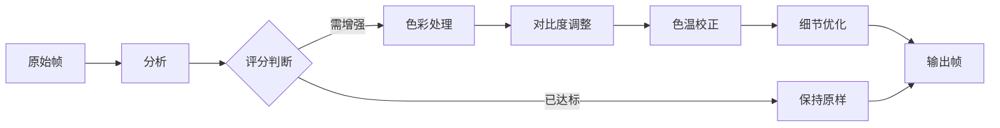

# VidLuxe 处理引擎

## 概述

处理引擎负责对视频帧进行实际的图像处理，实现色彩分级、对比度调整、色温校正等高级感增强效果。

---

## 架构设计

### 处理流程



### 模块划分

```typescript
// packages/core/src/processor/index.ts

export interface ColorProcessor {
  applyProfile(imageData: ImageData, profile: PremiumProfile): ImageData;
  adjustSaturation(imageData: ImageData, value: number): ImageData;
  adjustContrast(imageData: ImageData, value: number): ImageData;
  adjustTemperature(imageData: ImageData, kelvin: number): ImageData;
  adjustHighlights(imageData: ImageData, value: number): ImageData;
  adjustShadows(imageData: ImageData, value: number): ImageData;
}

export interface VideoProcessor {
  process(frames: ImageData[], profile: PremiumProfile, intensity: number): Promise<ImageData[]>;
}

export interface FrameProcessor {
  processFrame(frame: ImageData, profile: PremiumProfile, intensity: number): ImageData;
}
```

---

## 色彩处理器

### 核心实现

```typescript
// packages/core/src/processor/color-processor.ts

export class ColorProcessorImpl implements ColorProcessor {
  /**
   * 应用高级感风格配置
   */
  applyProfile(imageData: ImageData, profile: PremiumProfile): ImageData {
    const data = new Uint8ClampedArray(imageData.data);

    // 1. 调整饱和度
    this.adjustSaturationInPlace(data, profile.saturation);

    // 2. 调整对比度
    this.adjustContrastInPlace(data, profile.contrast);

    // 3. 调整色温
    this.adjustTemperatureInPlace(data, profile.temperature);

    // 4. 调整高光和阴影
    this.adjustTonesInPlace(data, profile.highlights, profile.shadows);

    return new ImageData(data, imageData.width, imageData.height);
  }

  /**
   * 调整饱和度
   * @param imageData 原始图像数据
   * @param value 目标饱和度 (0-1)
   */
  adjustSaturation(imageData: ImageData, value: number): ImageData {
    const data = new Uint8ClampedArray(imageData.data);
    this.adjustSaturationInPlace(data, value);
    return new ImageData(data, imageData.width, imageData.height);
  }

  private adjustSaturationInPlace(data: Uint8ClampedArray, targetSat: number): void {
    for (let i = 0; i < data.length; i += 4) {
      const r = data[i];
      const g = data[i + 1];
      const b = data[i + 2];

      // 转换到 HSL
      const hsl = this.rgbToHsl(r, g, b);

      // 计算当前饱和度与目标的差异
      const currentSat = hsl.s;
      const factor = targetSat / (currentSat + 0.001);

      // 应用调整（限制范围）
      const newSat = Math.min(1, Math.max(0, currentSat * factor * 0.8 + targetSat * 0.2));
      hsl.s = newSat;

      // 转回 RGB
      const rgb = this.hslToRgb(hsl.h, hsl.s, hsl.l);
      data[i] = rgb.r;
      data[i + 1] = rgb.g;
      data[i + 2] = rgb.b;
    }
  }

  /**
   * 调整对比度
   * @param imageData 原始图像数据
   * @param value 目标对比度 (0-1)
   */
  adjustContrast(imageData: ImageData, value: number): ImageData {
    const data = new Uint8ClampedArray(imageData.data);
    this.adjustContrastInPlace(data, value);
    return new ImageData(data, imageData.width, imageData.height);
  }

  private adjustContrastInPlace(data: Uint8ClampedArray, targetContrast: number): void {
    // 对比度因子 (0.5-1.5)
    const factor = targetContrast * 1.5;
    const intercept = 128 * (1 - factor);

    for (let i = 0; i < data.length; i += 4) {
      data[i] = Math.min(255, Math.max(0, data[i] * factor + intercept));
      data[i + 1] = Math.min(255, Math.max(0, data[i + 1] * factor + intercept));
      data[i + 2] = Math.min(255, Math.max(0, data[i + 2] * factor + intercept));
    }
  }

  /**
   * 调整色温
   * @param imageData 原始图像数据
   * @param kelvin 目标色温 (3000-8000K)
   */
  adjustTemperature(imageData: ImageData, kelvin: number): ImageData {
    const data = new Uint8ClampedArray(imageData.data);
    this.adjustTemperatureInPlace(data, kelvin);
    return new ImageData(data, imageData.width, imageData.height);
  }

  private adjustTemperatureInPlace(data: Uint8ClampedArray, kelvin: number): void {
    // 色温到 RGB 的近似转换
    const temp = kelvin / 100;
    let r: number, g: number, b: number;

    if (temp <= 66) {
      r = 255;
      g = temp;
      g = 99.4708025861 * Math.log(g) - 161.1195681661;
      if (temp <= 19) {
        b = 0;
      } else {
        b = temp - 10;
        b = 138.5177312231 * Math.log(b) - 305.0447927307;
      }
    } else {
      r = temp - 60;
      r = 329.698727446 * Math.pow(r, -0.1332047592);
      g = temp - 60;
      g = 288.1221695283 * Math.pow(g, -0.0755148492);
      b = 255;
    }

    // 归一化
    r = Math.min(255, Math.max(0, r)) / 255;
    g = Math.min(255, Math.max(0, g)) / 255;
    b = Math.min(255, Math.max(0, b)) / 255;

    // 混合比例
    const mix = 0.15;

    for (let i = 0; i < data.length; i += 4) {
      const gray = (data[i] + data[i + 1] + data[i + 2]) / 3;
      data[i] = Math.min(255, Math.max(0, data[i] * (1 - mix) + (gray * r * 3) * mix));
      data[i + 1] = Math.min(255, Math.max(0, data[i + 1] * (1 - mix) + (gray * g * 3) * mix));
      data[i + 2] = Math.min(255, Math.max(0, data[i + 2] * (1 - mix) + (gray * b * 3) * mix));
    }
  }

  /**
   * 调整高光和阴影
   */
  adjustHighlights(imageData: ImageData, value: number): ImageData {
    const data = new Uint8ClampedArray(imageData.data);
    this.adjustTonesInPlace(data, value, 0);
    return new ImageData(data, imageData.width, imageData.height);
  }

  adjustShadows(imageData: ImageData, value: number): ImageData {
    const data = new Uint8ClampedArray(imageData.data);
    this.adjustTonesInPlace(data, 0, value);
    return new ImageData(data, imageData.width, imageData.height);
  }

  private adjustTonesInPlace(
    data: Uint8ClampedArray,
    highlights: number,
    shadows: number
  ): void {
    for (let i = 0; i < data.length; i += 4) {
      const luminance = (0.299 * data[i] + 0.587 * data[i + 1] + 0.114 * data[i + 2]) / 255;

      // 高光调整（亮度 > 0.5）
      if (luminance > 0.5 && highlights !== 0) {
        const factor = (luminance - 0.5) * 2;
        const adjustment = highlights * factor * 0.01;
        data[i] = Math.min(255, Math.max(0, data[i] + adjustment));
        data[i + 1] = Math.min(255, Math.max(0, data[i + 1] + adjustment));
        data[i + 2] = Math.min(255, Math.max(0, data[i + 2] + adjustment));
      }

      // 阴影调整（亮度 < 0.5）
      if (luminance < 0.5 && shadows !== 0) {
        const factor = (0.5 - luminance) * 2;
        const adjustment = shadows * factor * 0.01;
        data[i] = Math.min(255, Math.max(0, data[i] + adjustment));
        data[i + 1] = Math.min(255, Math.max(0, data[i + 1] + adjustment));
        data[i + 2] = Math.min(255, Math.max(0, data[i + 2] + adjustment));
      }
    }
  }

  // 工具方法
  private rgbToHsl(r: number, g: number, b: number): { h: number; s: number; l: number } {
    r /= 255;
    g /= 255;
    b /= 255;

    const max = Math.max(r, g, b);
    const min = Math.min(r, g, b);
    let h = 0;
    const l = (max + min) / 2;

    if (max !== min) {
      const d = max - min;
      switch (max) {
        case r: h = ((g - b) / d + (g < b ? 6 : 0)) / 6; break;
        case g: h = ((b - r) / d + 2) / 6; break;
        case b: h = ((r - g) / d + 4) / 6; break;
      }
    }

    const s = l > 0.5
      ? (max - min) / (2 - max - min)
      : (max - min) / (max + min);

    return { h, s: s || 0, l };
  }

  private hslToRgb(h: number, s: number, l: number): { r: number; g: number; b: number } {
    if (s === 0) {
      const gray = Math.round(l * 255);
      return { r: gray, g: gray, b: gray };
    }

    const hue2rgb = (p: number, q: number, t: number) => {
      if (t < 0) t += 1;
      if (t > 1) t -= 1;
      if (t < 1/6) return p + (q - p) * 6 * t;
      if (t < 1/2) return q;
      if (t < 2/3) return p + (q - p) * (2/3 - t) * 6;
      return p;
    };

    const q = l < 0.5 ? l * (1 + s) : l + s - l * s;
    const p = 2 * l - q;

    return {
      r: Math.round(hue2rgb(p, q, h + 1/3) * 255),
      g: Math.round(hue2rgb(p, q, h) * 255),
      b: Math.round(hue2rgb(p, q, h - 1/3) * 255),
    };
  }
}
```

---

## 视频处理器

### 帧处理管道

```typescript
// packages/core/src/processor/video-processor.ts

export interface VideoProcessorConfig {
  colorProcessor: ColorProcessor;
  analyzer: ColorAnalyzer;
  scorer: PremiumScorer;
}

export class VideoProcessorImpl implements VideoProcessor {
  private colorProcessor: ColorProcessor;
  private analyzer: ColorAnalyzer;
  private scorer: PremiumScorer;

  constructor(config: VideoProcessorConfig) {
    this.colorProcessor = config.colorProcessor;
    this.analyzer = config.analyzer;
    this.scorer = config.scorer;
  }

  /**
   * 处理视频帧序列
   */
  async process(
    frames: ImageData[],
    profile: PremiumProfile,
    intensity: number
  ): Promise<ImageData[]> {
    // 强度因子 (0-1)
    const factor = this.intensityToFactor(intensity);

    return frames.map(frame => this.processFrame(frame, profile, factor));
  }

  /**
   * 处理单帧
   */
  processFrame(
    frame: ImageData,
    profile: PremiumProfile,
    factor: number
  ): ImageData {
    // 1. 分析当前帧
    const analysis = this.analyzer.analyzeFrame(frame);

    // 2. 计算需要的调整量
    const adjustments = this.calculateAdjustments(analysis, profile, factor);

    // 3. 应用调整
    let processed = frame;
    if (adjustments.saturation !== 0) {
      processed = this.colorProcessor.adjustSaturation(
        processed,
        analysis.saturation.mean + adjustments.saturation
      );
    }
    if (adjustments.contrast !== 0) {
      processed = this.colorProcessor.adjustContrast(
        processed,
        profile.contrast
      );
    }
    if (adjustments.temperature !== 0) {
      processed = this.colorProcessor.adjustTemperature(
        processed,
        profile.temperature
      );
    }

    // 4. 应用高光/阴影调整
    if (profile.highlights !== 0 || profile.shadows !== 0) {
      processed = this.colorProcessor.applyProfile(processed, {
        ...profile,
        saturation: 1, // 已经调整过
        contrast: 1,   // 已经调整过
      });
    }

    return processed;
  }

  private calculateAdjustments(
    analysis: ColorAnalysis,
    profile: PremiumProfile,
    factor: number
  ): {
    saturation: number;
    contrast: number;
    temperature: number;
  } {
    return {
      saturation: (profile.saturation - analysis.saturation.mean) * factor,
      contrast: (profile.contrast - analysis.contrast.ratio / 21) * factor,
      temperature: (profile.temperature - analysis.colorTemperature) * factor * 0.01,
    };
  }

  private intensityToFactor(intensity: 'light' | 'medium' | 'strong'): number {
    const factors = {
      light: 0.3,
      medium: 0.6,
      strong: 1.0,
    };
    return factors[intensity];
  }
}
```

---

## 高级处理效果

### 色彩分级 (Color Grading)

```typescript
// packages/core/src/processor/effects/color-grading.ts

export interface ColorGrade {
  shadows: { hue: number; saturation: number; luminance: number };
  midtones: { hue: number; saturation: number; luminance: number };
  highlights: { hue: number; saturation: number; luminance: number };
}

export class ColorGradingEffect {
  /**
   * 应用三路色彩分级
   */
  apply(imageData: ImageData, grade: ColorGrade): ImageData {
    const data = new Uint8ClampedArray(imageData.data);

    for (let i = 0; i < data.length; i += 4) {
      const luminance = (0.299 * data[i] + 0.587 * data[i + 1] + 0.114 * data[i + 2]) / 255;

      // 确定影响的范围
      let shadowWeight = 0;
      let midtoneWeight = 0;
      let highlightWeight = 0;

      if (luminance < 0.33) {
        shadowWeight = 1 - luminance * 3;
        midtoneWeight = luminance * 3;
      } else if (luminance < 0.67) {
        midtoneWeight = 1 - Math.abs(luminance - 0.5) * 6;
        shadowWeight = Math.max(0, 0.33 - luminance) * 3;
        highlightWeight = Math.max(0, luminance - 0.67) * 3;
      } else {
        highlightWeight = (luminance - 0.67) * 3;
        midtoneWeight = 1 - (luminance - 0.67) * 3;
      }

      // 应用色彩偏移
      const rgb = { r: data[i], g: data[i + 1], b: data[i + 2] };

      // 这里可以添加更复杂的色彩混合逻辑
      // 当前为简化实现
    }

    return new ImageData(data, imageData.width, imageData.height);
  }
}
```

### 曲线调整 (Curves)

```typescript
// packages/core/src/processor/effects/curves.ts

export interface CurvePoint {
  input: number;  // 0-255
  output: number; // 0-255
}

export class CurvesEffect {
  /**
   * 应用 RGB 曲线
   */
  applyRgbCurves(
    imageData: ImageData,
    curve: CurvePoint[]
  ): ImageData {
    const data = new Uint8ClampedArray(imageData.data);
    const lut = this.createLut(curve);

    for (let i = 0; i < data.length; i += 4) {
      data[i] = lut[data[i]];     // R
      data[i + 1] = lut[data[i + 1]]; // G
      data[i + 2] = lut[data[i + 2]]; // B
    }

    return new ImageData(data, imageData.width, imageData.height);
  }

  /**
   * 创建查找表 (LUT)
   */
  private createLut(curve: CurvePoint[]): Uint8Array {
    const lut = new Uint8Array(256);

    for (let i = 0; i < 256; i++) {
      // 在曲线点之间插值
      let p1 = curve[0];
      let p2 = curve[curve.length - 1];

      for (let j = 0; j < curve.length - 1; j++) {
        if (i >= curve[j].input && i <= curve[j + 1].input) {
          p1 = curve[j];
          p2 = curve[j + 1];
          break;
        }
      }

      // 线性插值
      const t = (i - p1.input) / (p2.input - p1.input + 0.001);
      lut[i] = Math.round(p1.output + t * (p2.output - p1.output));
    }

    return lut;
  }
}
```

### 降噪 (Denoise)

```typescript
// packages/core/src/processor/effects/denoise.ts

export class DenoiseEffect {
  /**
   * 简单的高斯模糊降噪
   */
  apply(imageData: ImageData, strength: number = 1): ImageData {
    const { width, height, data } = imageData;
    const output = new Uint8ClampedArray(data.length);
    const radius = Math.ceil(strength);
    const sigma = strength;

    // 高斯核
    const kernel = this.createGaussianKernel(radius, sigma);

    for (let y = 0; y < height; y++) {
      for (let x = 0; x < width; x++) {
        let r = 0, g = 0, b = 0, weight = 0;

        for (let ky = -radius; ky <= radius; ky++) {
          for (let kx = -radius; kx <= radius; kx++) {
            const px = Math.min(width - 1, Math.max(0, x + kx));
            const py = Math.min(height - 1, Math.max(0, y + ky));
            const idx = (py * width + px) * 4;
            const k = kernel[(ky + radius) * (radius * 2 + 1) + (kx + radius)];

            r += data[idx] * k;
            g += data[idx + 1] * k;
            b += data[idx + 2] * k;
            weight += k;
          }
        }

        const idx = (y * width + x) * 4;
        output[idx] = r / weight;
        output[idx + 1] = g / weight;
        output[idx + 2] = b / weight;
        output[idx + 3] = data[idx + 3];
      }
    }

    return new ImageData(output, width, height);
  }

  private createGaussianKernel(radius: number, sigma: number): number[] {
    const size = radius * 2 + 1;
    const kernel: number[] = [];

    for (let y = 0; y < size; y++) {
      for (let x = 0; x < size; x++) {
        const dx = x - radius;
        const dy = y - radius;
        kernel.push(Math.exp(-(dx * dx + dy * dy) / (2 * sigma * sigma)));
      }
    }

    return kernel;
  }
}
```

---

## Web Worker 支持

```typescript
// packages/core/src/processor/worker.ts

import { ColorProcessorImpl } from './color-processor';
import type { PremiumProfile } from '@vidluxe/types';

const processor = new ColorProcessorImpl();

self.onmessage = (e: MessageEvent) => {
  const { type, payload, id } = e.data;

  try {
    let result: ImageData;

    switch (type) {
      case 'applyProfile':
        result = processor.applyProfile(
          payload.imageData,
          payload.profile as PremiumProfile
        );
        break;

      case 'adjustSaturation':
        result = processor.adjustSaturation(
          payload.imageData,
          payload.value
        );
        break;

      default:
        throw new Error(`Unknown type: ${type}`);
    }

    self.postMessage({
      id,
      success: true,
      result,
    });
  } catch (error) {
    self.postMessage({
      id,
      success: false,
      error: error instanceof Error ? error.message : 'Unknown error',
    });
  }
};
```

### 主线程调用

```typescript
// packages/core/src/processor/worker-client.ts

export class ProcessorWorkerClient {
  private worker: Worker;
  private pending: Map<string, { resolve: Function; reject: Function }>;
  private idCounter: number;

  constructor() {
    this.worker = new Worker(
      new URL('./worker.ts', import.meta.url),
      { type: 'module' }
    );
    this.pending = new Map();
    this.idCounter = 0;

    this.worker.onmessage = this.handleMessage.bind(this);
  }

  async applyProfile(
    imageData: ImageData,
    profile: PremiumProfile
  ): Promise<ImageData> {
    return this.send('applyProfile', { imageData, profile });
  }

  async adjustSaturation(
    imageData: ImageData,
    value: number
  ): Promise<ImageData> {
    return this.send('adjustSaturation', { imageData, value });
  }

  private async send(type: string, payload: any): Promise<ImageData> {
    const id = `${this.idCounter++}`;

    return new Promise((resolve, reject) => {
      this.pending.set(id, { resolve, reject });
      this.worker.postMessage({ type, payload, id });
    });
  }

  private handleMessage(e: MessageEvent): void {
    const { id, success, result, error } = e.data;
    const handlers = this.pending.get(id);

    if (!handlers) return;

    this.pending.delete(id);

    if (success) {
      handlers.resolve(result);
    } else {
      handlers.reject(new Error(error));
    }
  }
}
```

---

## 使用示例

### 基础使用

```typescript
import { ColorProcessorImpl, VideoProcessorImpl } from '@vidluxe/core';
import { PREMIUM_PROFILES } from '@vidluxe/types';

const colorProcessor = new ColorProcessorImpl();

// 应用风格配置
const profile = PREMIUM_PROFILES.minimal;
const enhanced = colorProcessor.applyProfile(originalFrame, profile);

// 单独调整
const saturated = colorProcessor.adjustSaturation(originalFrame, 0.45);
const warmer = colorProcessor.adjustTemperature(originalFrame, 5800);
```

### 视频处理

```typescript
const videoProcessor = new VideoProcessorImpl({
  colorProcessor: new ColorProcessorImpl(),
  analyzer: new ColorAnalyzer(),
  scorer: new PremiumScorer(),
});

// 处理帧序列
const frames = await extractVideoFrames(videoFile);
const enhancedFrames = await videoProcessor.process(
  frames,
  PREMIUM_PROFILES.morandi,
  'medium'
);
```

---

## 下一步

- [增强引擎](./enhancer.md)
- [评分引擎](./scorer.md)
- [部署方案](../DEPLOYMENT.md)
