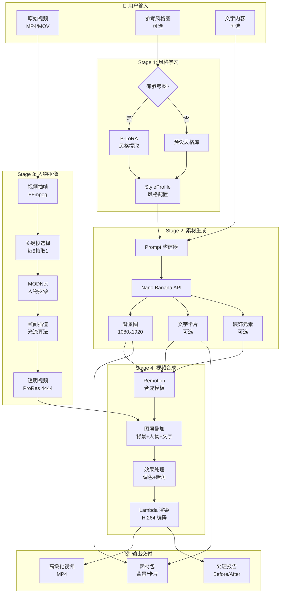
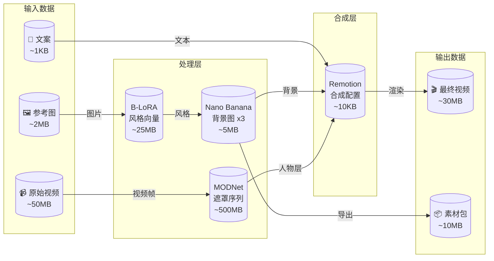
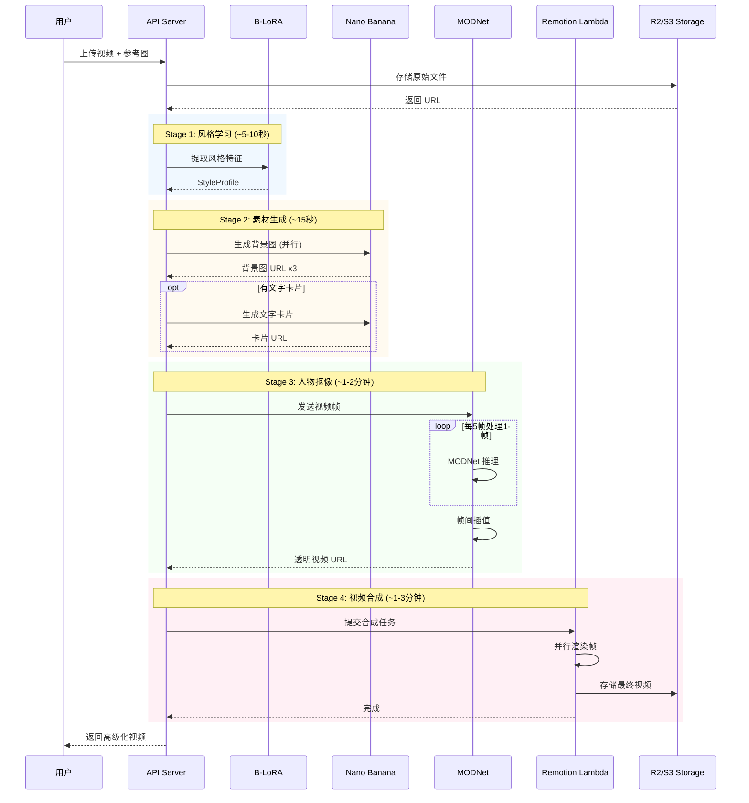
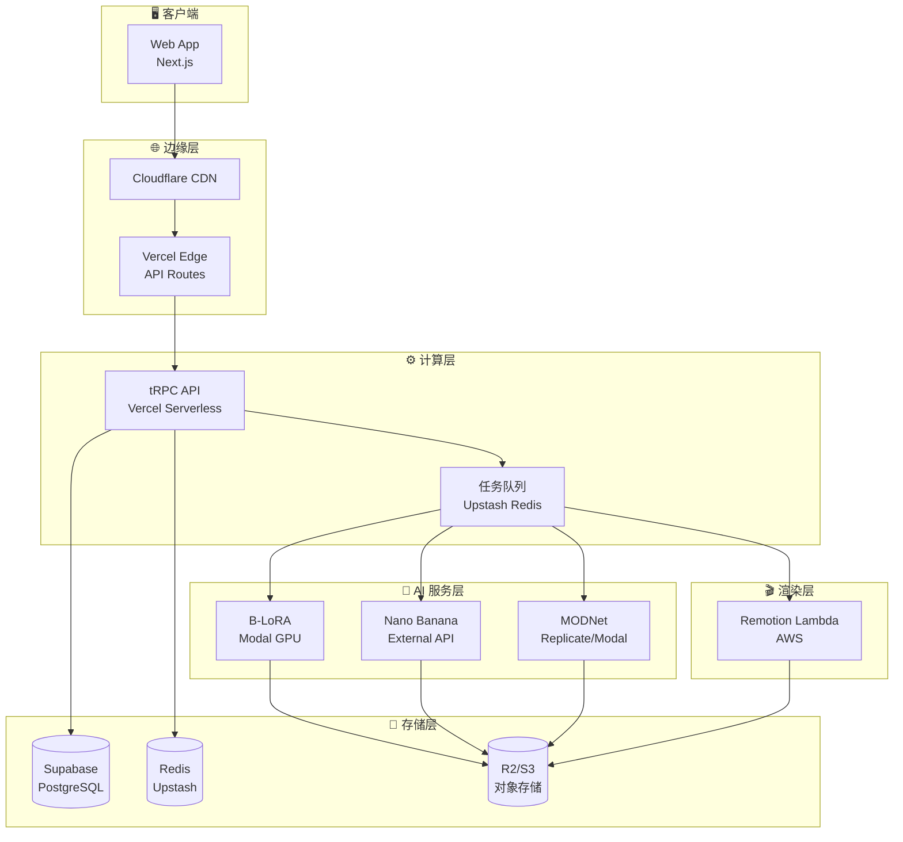
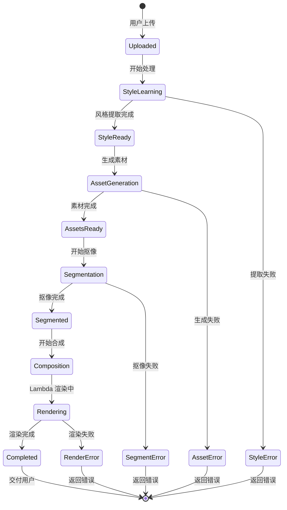
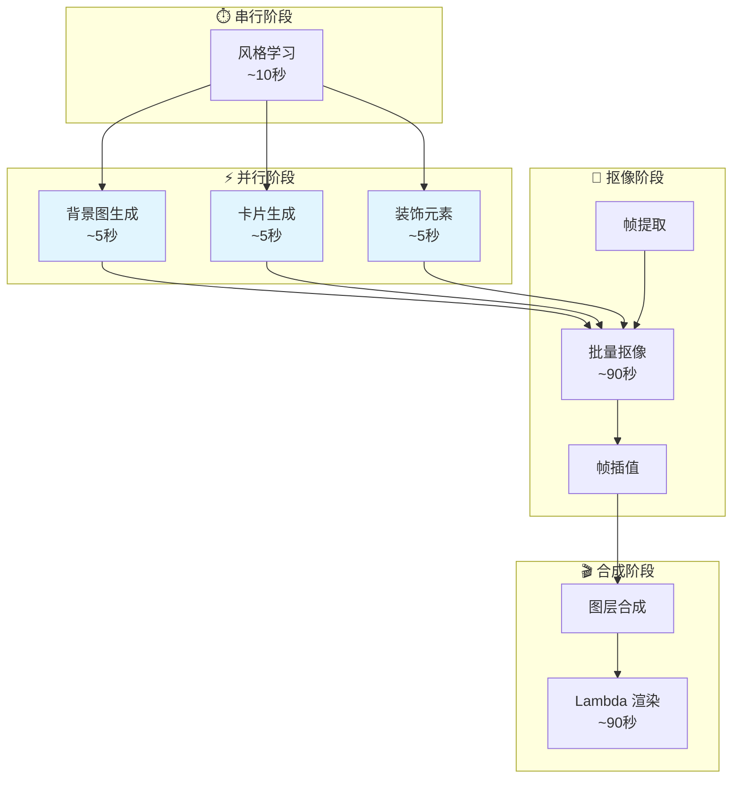
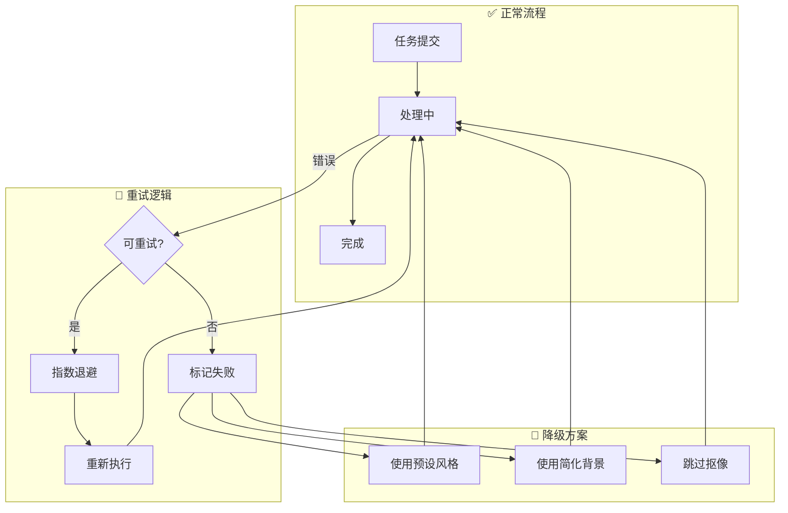
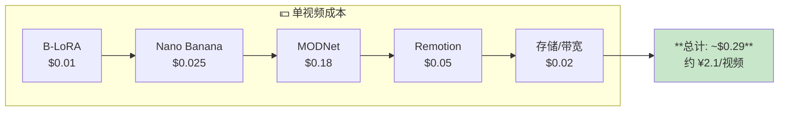
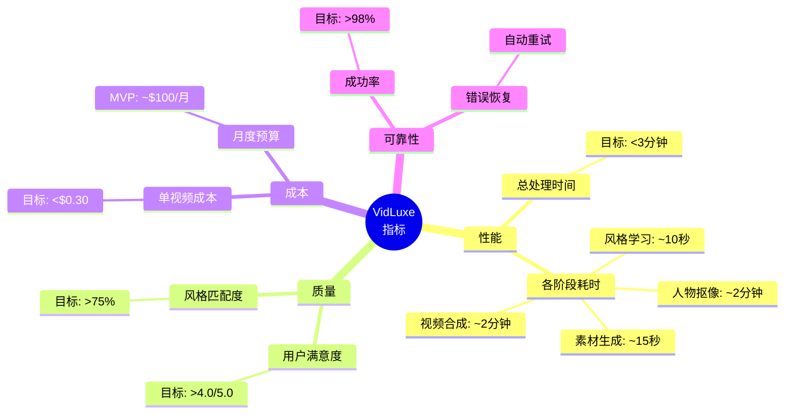

# VidLuxe 工作流程图

> **版本**: 1.0
> **更新日期**: 2026-02-16

## 完整工作流程图



---

## 数据流图



---

## 时序图



---

## 系统架构图



---

## 状态流转图



---

## 并行处理流程



---

## 错误处理流程



---

## 成本流程图



---

## 关键指标仪表板



---

## 使用说明

### 在 Markdown 中渲染

将以上 Mermaid 代码块复制到支持 Mermaid 的 Markdown 编辑器中即可渲染：

- **GitHub**: 原生支持
- **VS Code**: 安装 Markdown Preview Mermaid Support 插件
- **Typora**: 原生支持
- **Notion**: 使用 Mermaid 代码块

### 在线预览

- [Mermaid Live Editor](https://mermaid.live/)
- 复制代码块内容粘贴即可预览

### 导出图片

```bash
# 使用 Mermaid CLI
npx @mermaid-js/mermaid-cli -i workflow.mmd -o workflow.png
```

---

## 更新历史

| 日期 | 版本 | 变更 |
|------|------|------|
| 2026-02-16 | 1.0 | 初始版本 |
